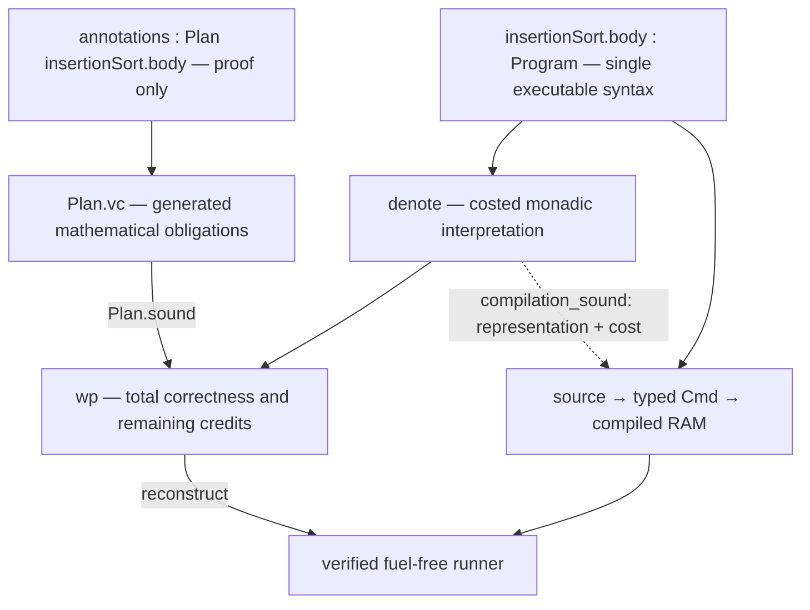

# Insertion-sort integration prototype

**One program, two connected interpretations:** [InsertionSort.lean](InsertionSort.lean)
defines a single `Authoring.Program` through the existing input/output DSL. We reason about
that program using a local Loom-style costed observation and compile the same program using
the existing verified RAM backend. Proof plans are indexed by the program they annotate.

This is an isolated experiment, not a replacement for the canonical `Programs` directory.
The prototype does not import either canonical sorting or its complete correctness theorem.

## Try it

```lean
import AlgoLib.Experimental.RAM.Prototype.InsertionSort
open AlgoLib.Experimental.RAM.Prototype

#eval (InsertionSort.run [3, 1, 4, 1]).value
-- [1, 1, 3, 4]

#eval (InsertionSort.run [3, 1, 4, 1]).steps

example (xs : List Nat) :
    InsertionSort.SortedPermutation xs (InsertionSort.run xs).value :=
  (InsertionSort.main xs).1

example (xs : List Nat) (h : xs ≠ []) :
    (InsertionSort.run xs).steps ≤ 205 * xs.length ^ 2 :=
  InsertionSort.quadratic xs h
```

Execution needs only an input list. The verified runner executes RAM instructions;
`List.orderedInsert` occurs in the logical procedure specification, not as a host-language
shortcut in this runner. The result contains both the output and the measured RAM steps.
The main bound `50n² + 100n + 55` includes preparation and covers the empty input.
As in the existing stack, host encoding/decoding and Lean runtime overhead are outside
the RAM cost model. This is a unit-cost natural-number RAM, not a bit-complexity claim.

## Read the example as a paper proof

| What an algorithm author does | Where it appears |
|---|---|
| Declare input, output, sorted permutation, and time bound | `insertionSort` |
| Write `while more { call insertNext; }` | The same method's `do` body |
| State that the suffix is sorted and all values are preserved | `invariant` |
| Charge the remaining insertions for scans and guard tests | `potential` |
| Attach that argument to the existing loop | `annotations : Plan insertionSort.body` |
| Prove insertion preserves the argument | `insertion_preserves` |
| Discharge initialization, exit, and total payment | `verification` |
| Obtain the executable and its theorem | `certified`, `run`, `main`, `exists_sort` |

The array is viewed as an unprocessed prefix and a sorted suffix. The library's
`insertNext` removes the rightmost unprocessed value and inserts it into the suffix.
It is a modular procedure with a certified RAM inner scan, not an arbitrary effect
assigned a convenient price. Its public contract requires a nonempty prefix, preserves
the input values, and charges `sorted.length + 1` logical credits.

With `k` values remaining and `m` already sorted, the potential is `k(k + m + 2)`.
One insertion decreases `k`, increases `m`, and leaves `k + m` constant. The released
potential pays for the procedure and the guard. One additional credit covers the last
false guard. `prototype_steps` substitutes procedure contracts; arithmetic tactics
check the payment. The user supplies the invariant and this charging argument.

## How the components connect



1. **Program construction.** The existing DSL elaborates the method body once to
   `Authoring.Program`. Inputs scope over contracts and budgets, not over code generation.
   The supported nodes are certified calls, sequencing, branches, loops, and skip.

2. **Mathematical interpretation.** `denote` interprets each node independently as
   a stateful computation with a logical cost. Sequencing uses monadic bind; loops
   use a finite-iteration relation. This interpretation does not execute the RAM compiler.
   [Observation.lean](Observation.lean) proves the monad laws and the pure/bind WP laws.

3. **Annotation and VC generation.** A `Plan p` contains loop invariants and structure
   matching `p`. It cannot silently annotate a different program. `Plan.vc` substitutes
   effects, checks call preconditions, and subtracts credits. It does not synthesize
   invariants. `Plan.sound` derives the observation proof from these conditions.
   Its proof uses the WP composition laws and the total loop rule.

4. **Termination.** `wp_loop` uses strong induction on remaining credits. Every loop
   guard costs one credit, even when the body costs zero. Thus a valid loop proof
   establishes termination; a vacuous invariant cannot certify an infinite loop.
   There is no timeout or user-visible fuel parameter.

5. **Connection to compilation.** [Interpretation.lean](Interpretation.lean) proves
   `denote_iff_run` for every supported program, then `compilation_sound`: every
   denoted execution has a represented RAM execution costing at most the model's
   implementation overhead times its logical credits. Action/guard certificates
   and the existing typed compiler discharge this step compositionally.

6. **Certificate reconstruction.** [Verification.lean](Verification.lean)'s
   `reconstruct` uses the proved observation to construct the backend's existing
   VC certificate. This uses the generic `Run.vc` theorem inside Lean. It neither
   invokes the canonical sorting proof nor trusts an external certificate checker.
   `certify` packages the method for the existing runner, automatically.

7. **Execution and theorem.** The existing runner executes preparation and the
   compiled body. `VerifiedMethod.correct` yields the declared output predicate
   and time bound for that actual run. `main` exposes them together. Users do not
   prove normalization, register correspondence, frames, or cost transport.

The computation observation is existential total correctness. This is sufficient here
because `denote_deterministic` proves uniqueness of the supported program's result and
logical cost. Do not reuse this observation as a demonic WP for nondeterministic choice.

## Reused, new, and deliberately limited

| Component | Decision |
|---|---|
| RAM machine, typed compiler, termination-based runner | Reused unchanged |
| Insertion's implementation, memory frame and cost certificate | Reused as a local procedure contract |
| Executable program representation and method syntax | Reused `Authoring.Program` and `ram_method` |
| Monadic observation, its laws, and source connection | New kernel-checked local specialization |
| Program-indexed annotations and observation-based VCG | New |
| Reconstruction into the existing backend | New, automatic and kernel checked |
| Full Velvet parser, mutable-variable frontend, nested array-loop UX | Not implemented by this prototype |
| Full Loom `MAlg` hierarchy, transformer ecosystem, tactic integration | Not implemented by this prototype |
| Invariant discovery or trusted SMT | Not used |

In particular, the insertion scan remains a certified procedure. This experiment validates
the shared-representation/observation/compiler boundary and modular reasoning. It does
**not** yet demonstrate a Velvet-style proof of an explicitly written inner array loop.
That is the next integration test before considering a wholesale frontend migration.

## Attribution and dependency choice

Explicit credit goes to the **[Loom framework and its authors](https://github.com/verse-lab/loom)**
for the monadic-observation design ([POPL paper](https://verse-lab.org/papers/loom-popl26.pdf)),
and **[Velvet and its authors](https://github.com/verse-lab/velvet)** for the method/annotation
usability direction. These files are an original specialization of those ideas, not a
vendored copy or a claim that upstream Loom/Velvet is installed.

Upstream Loom's checked `master` toolchain is Lean `v4.24.0`; this repository uses
`v4.30.0-rc2`. For this bounded experiment we keep the repository's toolchain and dependency
graph. We have not established that upstream cannot be ported: a genuine upstream dependency
and its API compatibility remain a separate evaluation. The observation and bridge have
been kept separate to make that replacement reviewable.

## Build and trust checks

```sh
lake build AlgoLib.Experimental.RAM.Prototype.Tests \
  AlgoLib.Experimental.RAM.Prototype.Axioms
python3 AlgoLib/Experimental/RAM/Tests/check_layers.py
lake build
```

[Tests.lean](Tests.lean) executes all 364 lists of length at most five over `{0,1,2}`,
plus longer ascending, descending, and duplicate-only inputs. It also tests rejected
budgets/preconditions, both branches, sequence, and mismatched annotations.
[Axioms.lean](Axioms.lean) pins the actual axiom dependencies of the observation laws,
semantic/compilation connections, VCG, reconstruction, and end-to-end sorting theorems.
It permits only the same standard Lean axioms as the existing stack, with exact lists
per theorem; neither `sorryAx` nor native/SMT oracle axioms are accepted.

Both modules are imported by the repository build. Existing axiom checks are unchanged.
The structural checker also keeps the reusable prototype modules independent of the
sorting example and keeps production layers from acquiring a prototype dependency.
