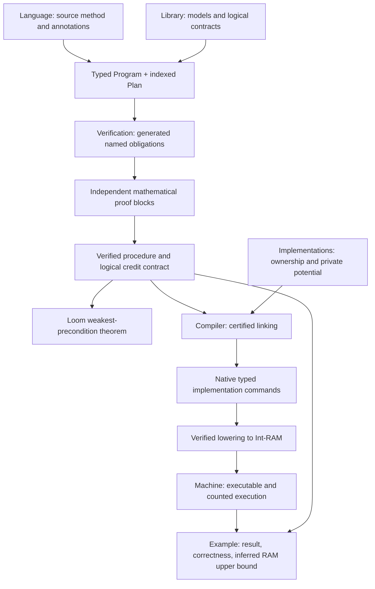

# Verified algorithms on Int-RAM

Write a typed, paper-style algorithm, prove its named mathematical obligations,
and obtain an executable with a correctness theorem and an inferred RAM upper bound.
Start with **[insertion sort](Examples/InsertionSort/README.md)** or
**[BFS connectivity](Examples/BFS/README.md)**. These are the supported examples.

For the supported imports and preferred declaration names, see [the public API](docs/PUBLIC-API.md).
The [generated dependency map](docs/DEPENDENCIES.md) explains actual imports.

## The six layers and the proof-authoring interface

| Layer | Exposes | Read it when… |
| --- | --- | --- |
| 1. [Language](Language/README.md) | Typed variables, arrays, loops, calls, invariants, logical credits | Writing a program or extending source syntax |
| 2. [Library](Library/README.md) | Mathematical models and functional/resource contracts | Calling or specifying reusable operations |
| 3. [Implementations](Implementations/README.md) | Private layouts, ownership, potential, certified operations | Implementing a data structure |
| 4. [Compiler](Compiler/README.md) | Linking, typed lowering, semantic and cost preservation | Maintaining code generation |
| 5. [Machine](Machine/README.md) | Integer instructions, execution semantics, instruction count | Examining the computational model |
| 6. [Examples](Examples/README.md) | Complete algorithms, proofs, execution, final theorems | Learning or evaluating the complete stack |
| Proof-authoring interface: [Verification](Verification/README.md) | Named propositions, separate proof blocks, explorer, Loom WP | Proving initialization, preservation, termination, and accounting |

These are responsibility boundaries, not seven sequential compiler passes.
Examples use the stack; Verification reasons about Language. Library contracts do
not depend on their concrete implementation. An import DAG check enforces the
backend-free logical layer and prevents reusable layers from importing examples.

### 1. Describe the algorithm

The preferred public import is `AlgoLib.Experimental.RAM.Language`.
The earlier `Language.Frontend` import remains supported.
`ram method` supports mutable Nat/Int variables, arrays, structured loops, and
registered procedure calls. Preconditions, postconditions, invariants, and counting
arguments use mathematical Lean values. See [the frontend guide](Language/FRONTEND.md).

Elaboration produces one typed `Program A B` and a `Plan` indexed by that exact body.
The plan adds proof information; it is not an independently executable algorithm.
Calls use procedure summaries during verification. The current structured language
inlines finite procedure bodies; general runtime recursion and dynamic allocation
are not claimed by this frontend.

### 2. Prove the mathematical obligations

`generate_obligations` establishes named Lean propositions. Inspect one with
`#explain_obligation`, prove it in a separate `prove_obligation` declaration, then
use `complete_algorithm`. See [the obligation API](Verification/OBLIGATION-API.md).
The author supplies invariants and the counting argument; the framework supplies
structural verification conditions. The underlying soundness results give abstract
execution and a Loom WP theorem for the same body.

### 3. Select verified implementations

A queue contract describes its mathematical sequence and logical charges. An
implementation chooses its cells, representation relation, and amortization
potential. Ownership framing proves that an operation preserves unrelated memory.
Resource-aware refinement relates its actual execution cost to logical charges
and private potential. Clients never prove facts about queue field addresses.

### 4. Link and compile

Assembly selects implementations and reconstructs a `Linked` certificate.
`compile_array_method` and `compile_scalar_method` package standard cases.
Native typed commands compile to integer instructions with kernel-checked semantic
and counted-execution theorems. Existing natural-valued implementation contracts
use a maintained source adapter into this compiler; this is not a second RAM backend.

### 5. Run and use the result

The executable runner takes ordinary encoded inputs and returns an observed value
and an actual instruction count. Termination evidence removes the need for user
fuel. Final assembly combines the algorithm proof and implementation certificates
into functional correctness and a physical upper bound.

**Logical credits are not instruction counts.** Logical contracts are stable across
implementation substitution. Concrete rates and private potential justify the RAM
bound; that bound may be conservative and may change after compiler improvements.
The machine uses unbounded, unit-cost Int arithmetic, not word-RAM or bit complexity.
Input encoding/output observation determine the accounting boundary; host-language
serialization is not automatically charged as RAM work.

## Find the file you need

For an algorithm, follow `Program.lean → Obligations.lean → Proofs.lean → Execution.lean`.
Read `Backend.lean` or `Storage.lean` only to select or develop an implementation.
Sorting separates backend certificates from proof edits so those edits can reuse
compiled artifacts. Each example entry page links every part and its final theorem.

For framework changes:

- Syntax and mutable elaboration: `Language/Elaboration/`.
- Proof plans, obligation generation, and editor diagnostics: `Verification/`.
- Abstract data-structure contract: `Library/`.
- Ownership/refinement laws: `Implementations/Contracts/`.
- Concrete layouts and operations: `Implementations/Native/` and `DataStructures/`.
- Source-to-implementation linking: `Compiler/Assembly/`.
- Instruction compiler: `Compiler/Native/`.
- Execution semantics: `Machine/Integer/`.

## Status, history, and trust

[Historical](Historical/README.md) preserves older adapters and regression evidence.
[Research](Research/README.md) contains ordinary-Velvet, recursive, and
nondeterministic semantic fixtures, not alternative supported frontends.
Neither directory is the starting point for new algorithms.

Module paths and preferred public aliases now follow responsibilities. Existing
declaration names remain compatible; `Prototype.Composition` is not a second implementation. See
[the migration guide](docs/MIGRATION.md) and [API policy](Verification/API-POLICY.md).

Run `lake build` and `python3 AlgoLib/Experimental/RAM/Tests/check_layers.py`.
Conformance, axiom, layout-substitution, proof-edit, and elaboration checks are in
[Tests](Tests/README.md). Bounded frontend tests complement the formal compiler
proofs; they are not a universal surface-parser semantics theorem.

We reuse Loom's algebra/WP infrastructure and Velvet syntax. Ownership and
resource-aware data-structure refinement follows the direction of
[Sepref](https://www21.in.tum.de/~lammich/pub/cpp2016_impds.pdf).
See [vendored framework attribution](../../../vendor/README.md).
