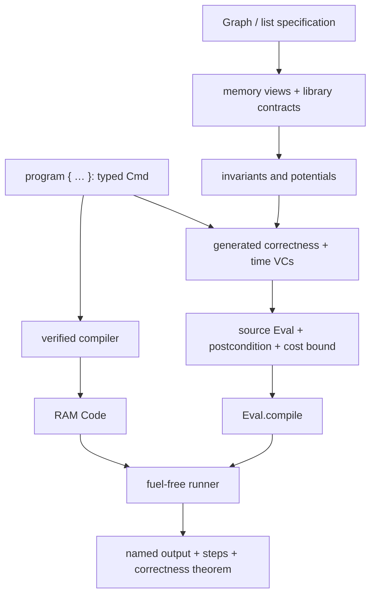

# One verified RAM stack

Write a typed source program, establish its correctness and time contract, compile it to RAM, and run it without fuel. Both complete demos use this pipeline. Their correctness statements and time bounds describe the **same compiled execution**.

```lean
import AlgoLib.Experimental.RAM
open AlgoLib.Experimental.RAM.Algorithms

#eval (InsertionSort.run [3, 1, 4, 2, 1]).values
-- [1, 1, 2, 3, 4]

example (xs : List Nat) : (InsertionSort.run xs).values.Perm xs :=
  (InsertionSort.run_correct xs).2.1
```

Start with [executable examples](Algorithms/Examples.lean), then read the matching [insertion-sort program](Algorithms/InsertionSort.lean) or [BFS program](Algorithms/BFS.lean). These files put source, specification, verification conditions, public input/output, and end-to-end theorems together.

## BFS: explicit input and output

```lean
import AlgoLib.Experimental.RAM.Algorithms.Examples
open AlgoLib.Experimental.RAM.Algorithms
open Examples

#eval report path 0 (by decide)
-- ([0, 1, 2, 3], 574)
#eval report splitGraph 3 (by decide)
-- ([3], 142)

-- Arguments: certified adjacency input and source. No fuel.
#eval (BFS.run (path.fromSource 0 (by decide))).visited.toList
```

`EdgeInput` supplies labelled undirected edges and their validity proofs. `fromSource` constructs the adjacency representation and certifies its relation to the repository's `Graph`. `BFS.run` returns named `visited` and `steps` fields. `.contains v` queries the bitmap; `.toList` formats it for display.

`BFS.run_correct` proves that a vertex is marked **iff it is reachable from the source**, even for disconnected graphs. `BFS.connected_iff` proves that every graph vertex is marked **iff the graph is connected**, assuming a valid source. These are different claims: a correct BFS also solves reachability on a disconnected graph.

| Algorithm | Functional guarantee | Bound on compiled RAM steps |
|---|---|---|
| Insertion sort | Sorted permutation; raw contract also preserves outside memory | `20n² + 40n + 10`, hence `70n²` for `n ≥ 1` |
| BFS | Exactly the reachable vertices; all vertices iff connected | `65n + 160m + 45`, hence `160(n+m)` for a valid source |

Here `m` counts labelled edges, including parallel edges; loops contribute two incidences. The programs are fixed syntax trees independent of the input size and values. These bounds establish uniform upper bounds, not exact `n²` running time or lower bounds.

## Component map



The demos reuse instruction invariants through a verified source refinement adapter. The adapter is a proof technique: execution still goes through the ordinary typed compiler. [Architecture](docs/ARCHITECTURE.md) spells out this proof path and its conservative factor-five cost bound. Generated VCs do not infer invariants or automatically solve all mathematical obligations.

## Read, extend, and check

| Your task | Entry point |
|---|---|
| Run and use theorems | [Algorithms/Examples.lean](Algorithms/Examples.lean) |
| Write new source code | [Language tutorial](Language/README.md), [Syntax.lean](Language/Syntax.lean) |
| Understand compilation and VCs | [Architecture and theorem ledger](docs/ARCHITECTURE.md) |
| Check modeling decisions | [Design principles and limits](docs/PRINCIPLES.md) |
| Find an old module | [Migration map](docs/MIGRATION.md) |
| Present the design | [Presentation with speaker notes](docs/PRESENTATION.md) |
| Inspect regressions | [Algorithm tests](Tests/Algorithms.lean), [language/library tests](Tests/Language.lean) |

```sh
lake build                            # entire repository
lake build AlgoLib.Experimental.RAM   # public stack
lake env lean AlgoLib/Experimental/RAM/Algorithms/Examples.lean
```

The cost model is a **unit-cost natural-number RAM**. Arithmetic and random access each have constant modeled cost; this is not bit complexity or Lean wall-clock time. Input encoding, proof checking, and host-side output formatting are outside `steps`. BFS does pay for clearing flags and initializing its FIFO. See the design principles before comparing theorems for different input encodings.
