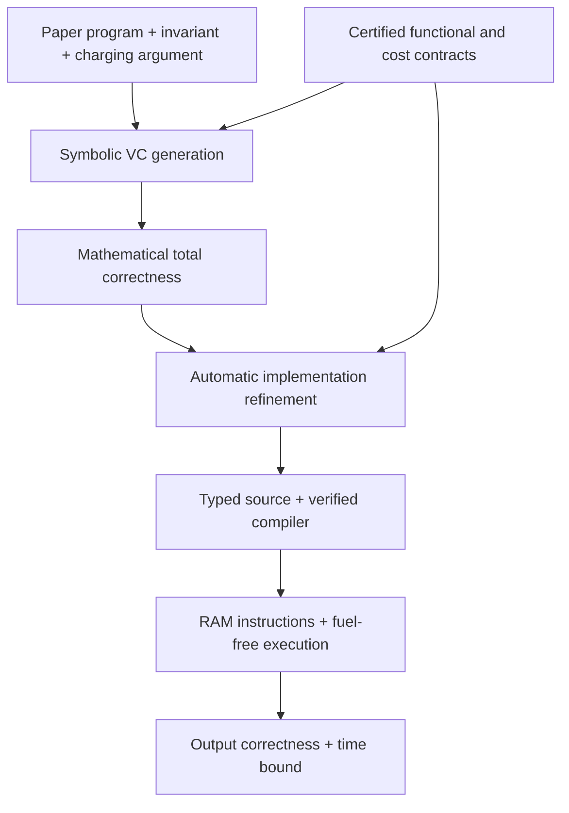

# Verified RAM programs from paper proofs

Write an algorithm using certified operations, supply its mathematical invariant and a charging argument, and obtain correctness, termination, and a time bound for the compiled RAM program. Algorithm proofs do not mention registers, heap addresses, normalization, or compiler correspondence.

Start with [runnable examples](Paper/Examples.lean), then the [authoring tutorial](Paper/README.md).

```lean
import AlgoLib.Experimental.RAM
open AlgoLib.Experimental.RAM.Paper

#eval (Insertion.run [3, 1, 4, 2, 1]).value
-- [1, 1, 2, 3, 4]

example (xs : List Nat) : (Insertion.run xs).value.Perm xs :=
  (Insertion.run_correct xs).2
```

The user-facing proofs are [BFS](Paper/BFS.lean) and [insertion sort](Paper/InsertionSort.lean). The BFS program is:

```lean
def program (a : Adjacency) : Program (model a) := paper {
  while (queueNonempty a) {
    call dequeue a;
    call (scanNeighbors a).call;
    call finish a;
  }
}
```

`dequeue` removes the queue front and opens its adjacency iterator. `scanNeighbors` is a separately verified loop that marks and enqueues unseen neighbors. `finish` records a processed vertex in ghost state and emits no instructions. Input preparation clears visited flags and seeds the source; its work is included in the executable's bound.

The proof supplies three named obligations: `preservation`, `payment`, and `exit`. `paper_steps` substitutes functional contracts, frames untouched data, and collects payments. `paper_credits` solves routine natural-number budget arithmetic. Loop invariants and the mathematical charging argument are supplied by the author.

## What is proved

| Executable | Correctness | Bound on actual RAM steps |
|---|---|---|
| `Paper.Insertion.run xs` | Sorted permutation | `50n² + 100n + 55`; at most `205n²` for nonempty input |
| `Paper.BFS.run input` | Marks exactly the reachable vertices | At most `370(n+m)` for a valid source |

For BFS, [the executable theorems](Paper/BFSExecutable.lean) also prove that all graph vertices are marked iff the graph is connected. This uses the repository's `Graph` specification, with an adjacency-list representation supporting self-loops and parallel labelled edges. A disconnected graph still receives a correct reachable-set result.

The constants are conservative library-contract bounds. They are not exact runtimes. Source programs are fixed independently of input size; all instructions, guards, and input preparation are charged. The runner takes no fuel.

## Navigate by role

| Role | Read |
|---|---|
| Run algorithms and apply theorems | [Examples](Paper/Examples.lean) |
| Write an algorithm proof | [Tutorial](Paper/README.md), [BFS](Paper/BFS.lean), [insertion sort](Paper/InsertionSort.lean) |
| Use functional/cost contracts | [Graph traversal](Paper/Search.lean), [array insertion](Paper/Array.lean) |
| Extend verification automation | [Proof calculus](Paper/Basic.lean), [syntax and tactics](Paper/Syntax.lean), [input/output](Paper/Interface.lean) |
| Implement a data structure | [Internal contracts](Internal/), [footprint framing](Library/Framing.lean) |
| Audit compilation | [Architecture](docs/ARCHITECTURE.md), [principles and limits](docs/PRINCIPLES.md) |
| Find older interfaces | [Migration](docs/MIGRATION.md) |
| Check behavior and soundness boundaries | [New regressions](Tests/Paper.lean), [existing regressions](Tests/Algorithms.lean) |



```sh
lake build
lake build AlgoLib.Experimental.RAM.Tests.Paper
lake env lean AlgoLib/Experimental/RAM/Paper/Examples.lean
```

The cost model is a unit-cost RAM over natural numbers, not bit complexity or Lean wall-clock time. Encoding an external input and formatting an output are host operations outside the step count. The earlier `Algorithms` and typed `Language` APIs remain available for compatibility and library implementation; they are not the recommended algorithm-authoring tutorial. This is an experimental proof interface, not a full Dafny implementation or an undergraduate IDE.
