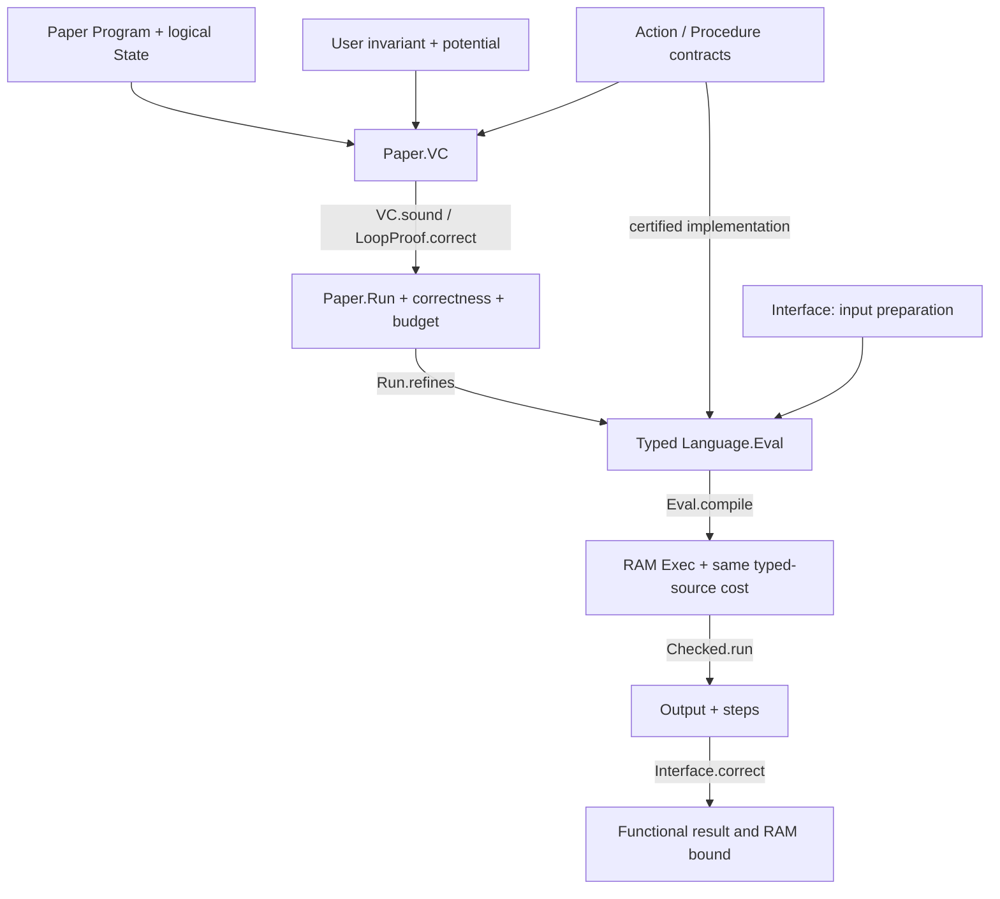

# Architecture and theorem ledger

Algorithm authors start in [Paper/README.md](../Paper/README.md). This document is for maintainers auditing the automated path.

## Boundaries

| Component | Responsibility | Does not ask algorithm clients for |
|---|---|---|
| `Paper/Syntax.lean` | Compositional calls, branches, loops; symbolic effects and credit arithmetic | Normalization proofs |
| `Paper/Basic.lean` | Independent mathematical semantics, VC soundness, procedure contracts, implementation refinement | Compiler transport |
| `Paper/Interface.lean` | Paid initialization, compilation, termination, execution, output interpretation | Fuel or store encoding proofs |
| `Paper/Search.lean`, `Paper/Array.lean` | Stable mathematical APIs | Physical representation unfolding |
| `Internal/Search*.lean`, `Internal/Insertion*.lean` | Representations, implementations, local certificates, input/output bindings | Repeated proofs from each client |
| `Library/Framing.lean` | Generic footprint frame rules | Re-proving every unrelated cell is unchanged |
| `Language/` | Typed variables/expressions/arrays/procedures, semantics, verified compiler | Knowledge of the user invariant |
| `Core/` | RAM instruction semantics and fuel-free execution | Host computation or fabricated cost annotations |

## Key theorems

| Theorem | Meaning |
|---|---|
| `Paper.VC.sound` | Generated VCs establish a terminating mathematical run and remaining credits |
| `Paper.LoopProof.correct` | Named loop obligations establish total correctness using a potential |
| `Paper.Run.refines` | Every mathematical run has a represented typed execution within library overhead |
| `Paper.Procedure.call` | A verified body becomes a reusable action without exposing its proof to callers |
| `Paper.Correct.method` | A paper proof automatically supplies a typed method contract |
| `Paper.Interface.correct` | Paid preparation and compiled execution satisfy the observed postcondition and RAM bound |
| `Language.Framing.frame` | Disjoint read/write footprints preserve an arbitrary registered representation |
| `Language.Eval.compile` | Typed execution compiles with its exact source cost and observable state |
| `Paper.BFS.run_correct`, `.connected_iff`, `.linear` | End-to-end reachability, connectivity, and linear RAM work |
| `Paper.Insertion.run_correct`, `.quadratic` | End-to-end sorted permutation and quadratic RAM work |

## Why this is not just a wrapper around a whole-algorithm theorem

BFS's new outer proof uses mathematical frontier maintenance and a potential. Its adjacency loop is a separately verified `Procedure`; its primitive `visit` and `dequeue` contracts reuse local implementation lemmas. The new proof never invokes `bfs_correct` or `bfs_loop_correct` to prove the new algorithm.

Insertion sort's new outer proof uses sortedness and permutation of lists. Its library insertion operation is certified using `insertCode_exec`, not the old whole-sort theorem. Thus a different outer invariant, client, or composition can reuse the local operation without redoing its memory proof.

Inside the library, the existing instruction adapter remains a way to reuse local proofs. Its normalization/register/cost details are implementation responsibilities. They are not VCs exposed to paper authors. The same typed compiler and RAM runner are used throughout; there is no host evaluator substituted for the charged executable.

## Review checks

1. Check the `Action.correct` implementation theorem and the guard correspondence, not just its advertised cost.
2. Check input preparation is included, and distinguish host encoding/formatting costs.
3. Check logical invariants and charging lemmas in the two paper proofs.
4. Check footprint disjointness before accepting a library frame.
5. Run `lake build` and `lake build AlgoLib.Experimental.RAM.Tests.Paper`.
6. Inspect kernel axioms of the generic soundness and final algorithm theorems.

The existing presentation deck describes the pre-Paper typed stack. Its compiler and RAM layers remain relevant; use this diagram and the new tutorial for the current authoring path.
