# Architecture and proof ledger

The public import is `AlgoLib.Experimental.RAM`. The runtime path has one frontend and one compiler:

`Language.Syntax → Language.Basic.Cmd → Cmd.compile → Core.Code → Core.run`.

The source semantics is defined independently of compilation. Verification produces a theorem about that semantics; compiler preservation carries it to RAM execution. The runner consumes the resulting termination witness and returns the observable store with the exact modeled step count.

## Responsibilities and dependencies

| Directory | Responsibility | What a client should use |
|---|---|---|
| `Algorithms/` | Complete typed programs, contracts, input/output wrappers, examples | `InsertionSort.run`, `BFS.run`, their correctness theorems |
| `Language/` | Typed AST, independent semantics, DSL macros, compiler, contracts and VCG | `Cmd`, `program`, `Procedure`, `VC`, `Method` |
| `Library/` | Array, FIFO, LIFO and graph representations with functional/cost contracts | `ArrayRef`, `QueueRef`, `StackRef`, `GraphRef`; graph input constructors |
| `Specification/` | Reachability/connectedness over the repository Graph and the SimpleGraph bridge | `Reachable`, `Connected`, `Represents` |
| `Core/` | Restricted instruction semantics, well-founded evaluator, observable outputs | `Code`, `Exec`, `run`, `Bitmap` |
| `Proofs/` | Internal algorithm invariants and mathematical refinement certificates | Read to audit or change an algorithm; not the public runtime API |
| `Tests/` | Execution, boundary, negative typing and cost regressions | Whole-repository build |

Directories organize responsibilities; they are not separate algorithm implementations. The generic library has two graph representations: linked lists used by the complete BFS and an additional CSR interface. Both refine the same adjacency specification. A CSR implementation of the complete BFS is not claimed.

## The execution theorem

A contract states that every admissible source store has an `Eval` derivation ending in a postcondition and within a budget. In schematic notation:

```text
requires s
  ⇒ ∃ k t, Eval body s k t ∧ ensures s t ∧ k ≤ budget s
  ⇒ ∃ k r, Exec body.compile (encode s) k r
             ∧ ensures s (observe r) ∧ k ≤ budget s
```

The first implication comes from the VCG and the algorithm proof. The second is compiler preservation. `Method.run` uses this existence theorem to obtain accessibility of the deterministic machine transition relation. The accessibility proof is erased; the executable follows machine transitions, with no fuel argument and no search for a sufficient bound.

| File | Key declaration | Guarantee |
|---|---|---|
| [Basic](../Language/Basic.lean) | `Eval` | Independent source semantics with exact costs |
| [Compiler](../Language/Compiler.lean) | `Eval.compile` | Compiled RAM preserves observed store and exact cost |
| [VC](../Language/VC.lean) | `VC.sound`, `VC.contract` | Generated obligations imply total correctness and a bound |
| [VC](../Language/VC.lean) | `VC.complete`, `Contract.vc` | Existing semantic proofs can discharge the same generated obligations |
| [Verification](../Language/Verification.lean) | `Contract.ram`, `Method.correct` | Source contract reaches actual compiled execution |
| [Runner](../Core/Runner.lean) | `run_eq`, `run_correct` | Fuel-free evaluation agrees with the execution relation |
| [InsertionSort](../Algorithms/InsertionSort.lean) | `verification`, `ram_correct`, `run_correct`, `quadratic` | Source VCs, sorted permutation/frame, uniform quadratic bound |
| [BFS](../Algorithms/BFS.lean) | `verification`, `ram_correct`, `run_correct`, `linear`, `connected_iff` | Source VCs, exact reachability, connectivity, uniform linear bound |
| [GraphBridge](../Specification/GraphBridge.lean) | `reachable_toGraph`, `connected_toGraph` | Agreement with repository SimpleGraph connectivity |

Most language declarations are in `AlgoLib.Experimental.RAM.Checked.Language`. Public algorithms are in `AlgoLib.Experimental.RAM.Algorithms`. The retained graph specification/library and BFS invariant names use `AlgoLib.Experimental.RAM.BFS`; they contain no competing BFS runner.

## How the complete demos reuse proofs

Insertion sort and BFS already had instruction-level invariant proofs. Reproving their mathematics after changing the frontend would obscure the refactor. The proof adapter connects those invariants to the actual typed programs:

```mermaid
flowchart LR
  Cert["Proofs: Exec certificate"] --> Lift["Refinement.lift_correct"]
  Lift --> Typed["Eval of lifted Cmd; cost ≤ 5 × certificate cost"]
  Typed --> Norm["Eval.transfer; checked normalization equality"]
  Norm --> Source["Eval of Algorithms.sourceProgram"]
  Source --> VCG["Contract.vc"]
  VCG --> Method["Method with generated VCs"]
  Method --> Compiler["ordinary Cmd.compile and Runner"]
```



`Language.Refinement` supports the finite register bank used by these certificates and lifts each instruction into ordinary typed expressions and commands. It proves preservation of memory/register observations, readiness of the heap base, and a cost bound. No arbitrary evaluator enters the syntax. `Language.Normalization` proves that removing skips and reassociating sequences preserves exact execution; each algorithm's `refinement` is a definitional equality between normalized command trees.

The factor five pays for the lifted expression evaluation. It is a conservative proof bound; the compiler itself preserves source cost exactly. Old certificate bounds therefore become `20n²+40n+10` for sort and `65n+160m+45` for BFS. The public wrapper executes the newly compiled typed command, whose actual cost may be smaller than those bounds.

This approach verifies the generated VCs by transporting a semantic proof and using VCG completeness. It does **not** mean the system automatically inferred an invariant. New small examples in [LanguageExamples](../Algorithms/LanguageExamples.lean) illustrate direct source-level modular proofs. An eventual direct source proof for BFS could improve constants and remove the adapter dependency without changing the public interface.

## BFS proof in paper order

1. **Representation.** `Represents` maps adjacency membership to the repository Graph. `Heap` decodes immutable linked rows; `View` describes the visited flags and the live FIFO.
2. **Initialization.** Every flag is cleared, then the source is marked and enqueued. Arbitrarily initialized mutable memory is allowed.
3. **Maintenance.** Discovered vertices are `done ∪ queue`. They are reachable; the queue is distinct and disjoint from `done`; processed vertices have all neighbors discovered. Mark-before-enqueue preserves uniqueness.
4. **Exit.** An empty queue leaves a set closed under graph edges containing the source. Induction on a walk proves completeness; discovery proofs give soundness.
5. **Time and termination.** The instruction potential is `Σ v ∈ range n \ done, (8 + 16·degree(v))`. Processing a vertex removes exactly its charge. The total number of incidences is at most `2m`. Initialization and the final guards are included; the verified adapter pays the typed expression overhead.

The main maintenance theorem is `Invariant.process`; the potential identity is `potential_process`, both in [Proofs/BFS.lean](../Proofs/BFS.lean). They are separate from the public source body and input/output declarations.
