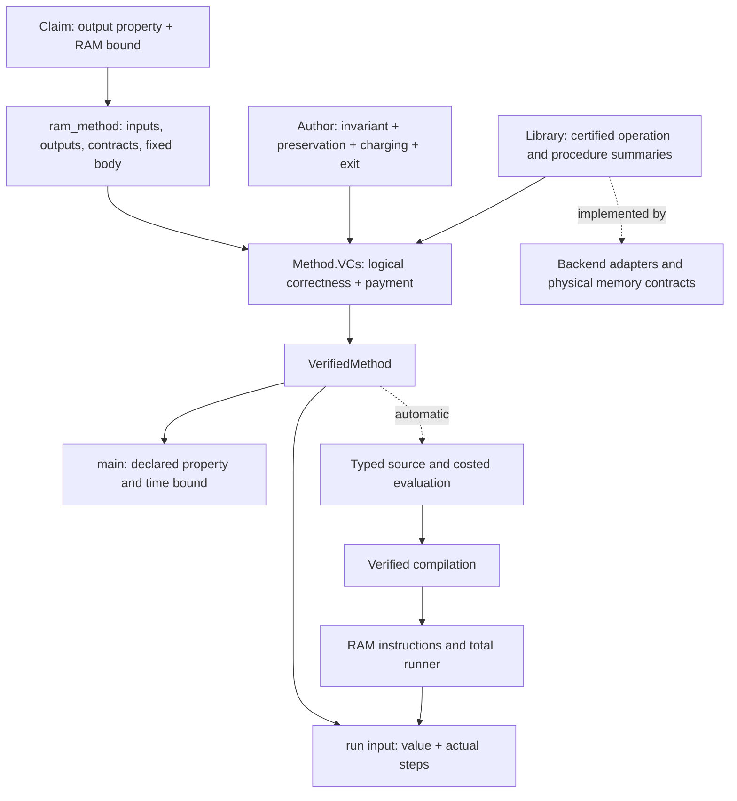

# How the abstraction layers connect

The user starts with [Programs/Sorting.lean](../Programs/Sorting.lean) or [Programs/Connectivity.lean](../Programs/Connectivity.lean). Each file states the target claim, declares the high-level method with input/output contracts, solves its generated obligations, and exposes the complete theorem. Supporting implementations are not competing program entry points.

## 1. A mathematical target

`Claim` contains no heap addresses, registers, or compiler states. Sorting requires a sorted permutation and a quadratic bound. Connectivity requires the exact reachable set, `Connected G ↔ S = G.vertexSet`, and a linear bound. The graph specification uses this repository's labelled undirected `Graph` and a finite adjacency representation.

## 2. One displayed method

`ram_method` elaborates to `Authoring.Method`. Its body is a single `Program`, independent of the input value. Input and output binders scope over contracts and budgets. An adapter supplies input preparation and output interpretation; the method body contains the actual certified-operation program. There is no separately selected implementation when it is run.

The public language is deliberately an operation/procedure language with compositional `call`, `while`, and `if`. Library subroutines can summarize common textbook blocks. BFS's neighbor loop is such a subroutine. This is distinct from pretending that an arbitrary Lean function or a display-only pseudocode block is verified executable code.

## 3. Generated verification conditions

`Method.VCs` asks, for every permitted input, for a logical VC of the body from the prepared state within the declared credits, with RAM time derived automatically from those credits. `paper_steps` substitutes logical effects and collects local payments. `method_vc` opens the method contract. No RAM-payment obligation is generated.

A `LoopProof` supplies preservation, payment, and exit. `Correct.output_vc` reuses that proof while exposing only initial validity, the available credits, and the mathematical meaning of the output. `Run.vc` justifies this reuse against the independent logical semantics. It is a generic theorem, not an algorithm-specific escape hatch.

## 4. Verified operation and procedure contracts

An `Action State` includes only a precondition, mathematical effect, and logical work allowance. A separate `ActionImplementation M action` supplies code and proves functional refinement and its instruction bound. A `Procedure` packages a verified composition as another action; symbolic execution uses its summary, while compilation includes its body.

The public `Library` files expose these logical contracts and stable adapter equations. Backend adapters prove concrete state representations and use physical array/queue/graph contracts. Read/write footprint framing preserves unrelated memory. Unchanged logical fields simplify at the public layer.

## 5. Automatic translation and execution

`Program.source` replaces actions with their certified implementations and preserves control flow. `Run.refines` establishes the represented result and implementation cost bound. `Backend.Language.Eval.compile` relates typed evaluation to RAM execution with the same observation and typed charged cost. The generic runner receives the resulting termination certificate.

`VerifiedMethod.correct` combines these results with the adapter's output observation and the automatically derived time bound. The same `run` therefore satisfies both the result property and the RAM-step bound. A program author never supplies normalization, instruction lifting, register correspondence, or compiler-overhead transport.

## Directory boundaries and dependencies

| Location | Owns | May depend on |
|---|---|---|
| `Programs` | Complete public algorithms | Public `Library`, `Authoring`, mathematical specifications |
| `Authoring` | Generic contract/VC/runner API | Generic typed backend and machine types |
| `Library` | Public logical operation and adapter equations | Authoring interfaces and concrete backend adapters |
| `Backend/Adapters` | Implementations of authoring interfaces | Authoring primitives, memory, typed language, certificates |
| `Backend/Memory` | Concrete representation and data-structure contracts | Typed contracts, machine types, graph specifications |
| `Backend/Language` | Typed semantics and compiler | Machine semantics; implementation libraries where needed |
| `Backend/Certificates` | Instruction-level evidence | Machine, memory, and mathematical facts |
| `Machine`, `Specification` | Execution foundation and mathematical graph meaning | Repository mathematics, without public algorithms |
| `Legacy` | Earlier optional demos | Backend interfaces; never imported by the public entry point |

The dependency graph is acyclic, but adapters implementing authoring interfaces mean the directory order is not a simple one-way numbered stack. The enforced architectural boundary is that reusable layers do not import `Programs` or `Legacy`, and public program files do not import `Backend`, `Machine`, or `Legacy` directly.

## Cost model and scope

The RAM uses unit-cost natural-number operations. The counted computation includes compiled preparation and the body. Host input encoding, list/bitmap display, proof checking, and wall-clock time are outside the count. Constants are upper bounds, not exact runtimes. An arbitrary new encoder/decoder or operation implementation is a library-design responsibility and must be reviewed together with its cost boundary. Time receipts remain deferred.

See [Credits and backends](CREDITS-AND-BACKENDS.md) for definitions and a runnable proof-reuse example.
