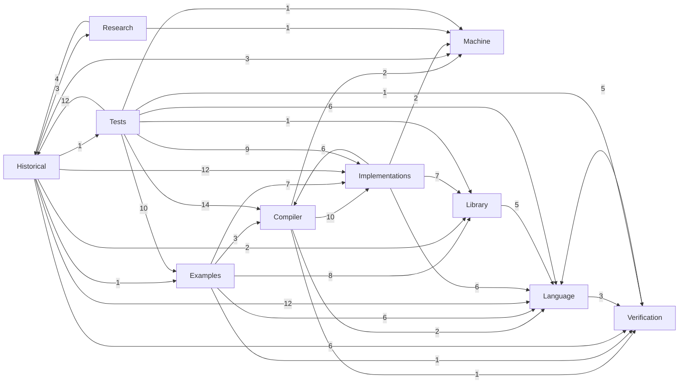

# Dependency map (generated)

Arrows mean **imports**, labelled with the number of direct module imports.
Aggregation can show cycles between layers (for example frontend convenience imports);
the actual module graph is checked to be acyclic. This is a dependency map, not an execution pipeline.

## Public entries

| Import | Direct dependencies |
| --- | --- |
| [Compiler](../Compiler.lean) | [Compiler/Assembly.lean](../Compiler/Assembly.lean) |
| [Examples](../Examples.lean) | [Examples/InsertionSort/Execution.lean](../Examples/InsertionSort/Execution.lean), [Examples/BFS/Execution.lean](../Examples/BFS/Execution.lean), [Examples/BFS/Inputs.lean](../Examples/BFS/Inputs.lean) |
| [Implementations](../Implementations.lean) | [Implementations/Native/Encoding.lean](../Implementations/Native/Encoding.lean) |
| [Language](../Language.lean) | [Language/Frontend.lean](../Language/Frontend.lean) |
| [Library](../Library.lean) | [Library/Queue.lean](../Library/Queue.lean), [Library/Stack.lean](../Library/Stack.lean), [Library/Buffer.lean](../Library/Buffer.lean), [Library/GraphCursor.lean](../Library/GraphCursor.lean), [Library/Graph/GraphBridge.lean](../Library/Graph/GraphBridge.lean) |
| [Machine](../Machine.lean) | [Machine/Integer/Runner.lean](../Machine/Integer/Runner.lean), [Machine/Output.lean](../Machine/Output.lean) |
| [Verification](../Verification.lean) | [Verification/ObligationExplorer.lean](../Verification/ObligationExplorer.lean), [Verification/Loom.lean](../Verification/Loom.lean) |

## Complete module imports

| Module | Direct local imports |
| --- | --- |
| [Compiler.lean](../Compiler.lean) | [Compiler/Assembly.lean](../Compiler/Assembly.lean) |
| [Compiler/Assembly.lean](../Compiler/Assembly.lean) | [Language/Frontend.lean](../Language/Frontend.lean), [Compiler/Assembly/Tactics.lean](../Compiler/Assembly/Tactics.lean), [Compiler/Assembly/Native/Execution.lean](../Compiler/Assembly/Native/Execution.lean) |
| [Compiler/Assembly/Native/Execution.lean](../Compiler/Assembly/Native/Execution.lean) | [Implementations/Native/Encoding.lean](../Implementations/Native/Encoding.lean), [Compiler/Assembly/Result.lean](../Compiler/Assembly/Result.lean) |
| [Compiler/Assembly/Native/Linking.lean](../Compiler/Assembly/Native/Linking.lean) | [Implementations/Contracts/ResourceRefinement.lean](../Implementations/Contracts/ResourceRefinement.lean), [Compiler/Native/Ownership.lean](../Compiler/Native/Ownership.lean) |
| [Compiler/Assembly/Natural/CertifiedExecutable.lean](../Compiler/Assembly/Natural/CertifiedExecutable.lean) | [Implementations/Natural/Encoding.lean](../Implementations/Natural/Encoding.lean) |
| [Compiler/Assembly/Natural/Execution.lean](../Compiler/Assembly/Natural/Execution.lean) | [Compiler/Assembly/Natural/Linking.lean](../Compiler/Assembly/Natural/Linking.lean), [Verification/Loom.lean](../Verification/Loom.lean), [Compiler/Assembly/Result.lean](../Compiler/Assembly/Result.lean), [Implementations/Contracts/ResidentInputs.lean](../Implementations/Contracts/ResidentInputs.lean), [Implementations/Natural/Language/IntegerExecution.lean](../Implementations/Natural/Language/IntegerExecution.lean) |
| [Compiler/Assembly/Natural/IntegerExecution.lean](../Compiler/Assembly/Natural/IntegerExecution.lean) | [Compiler/Assembly/Natural/Execution.lean](../Compiler/Assembly/Natural/Execution.lean) |
| [Compiler/Assembly/Natural/Linking.lean](../Compiler/Assembly/Natural/Linking.lean) | [Language/Contracts.lean](../Language/Contracts.lean), [Implementations/Natural/Ownership.lean](../Implementations/Natural/Ownership.lean), [Implementations/Contracts/ResourceRefinement.lean](../Implementations/Contracts/ResourceRefinement.lean), [Implementations/Natural/Language/IntegerExecution.lean](../Implementations/Natural/Language/IntegerExecution.lean) |
| [Compiler/Assembly/Result.lean](../Compiler/Assembly/Result.lean) | None |
| [Compiler/Assembly/Tactics.lean](../Compiler/Assembly/Tactics.lean) | None |
| [Compiler/Native/Basic.lean](../Compiler/Native/Basic.lean) | [Machine/Integer/Runner.lean](../Machine/Integer/Runner.lean) |
| [Compiler/Native/Compiler.lean](../Compiler/Native/Compiler.lean) | [Compiler/Native/Expressions.lean](../Compiler/Native/Expressions.lean), [Machine/Integer/Frame.lean](../Machine/Integer/Frame.lean) |
| [Compiler/Native/Execution.lean](../Compiler/Native/Execution.lean) | [Compiler/Native/Compiler.lean](../Compiler/Native/Compiler.lean) |
| [Compiler/Native/Expressions.lean](../Compiler/Native/Expressions.lean) | [Compiler/Native/Basic.lean](../Compiler/Native/Basic.lean) |
| [Compiler/Native/Natural.lean](../Compiler/Native/Natural.lean) | [Compiler/Native/Execution.lean](../Compiler/Native/Execution.lean), [Implementations/Natural/Language/Basic.lean](../Implementations/Natural/Language/Basic.lean) |
| [Compiler/Native/Ownership.lean](../Compiler/Native/Ownership.lean) | [Implementations/Contracts/Ownership.lean](../Implementations/Contracts/Ownership.lean), [Compiler/Native/Execution.lean](../Compiler/Native/Execution.lean) |
| [Examples.lean](../Examples.lean) | [Examples/InsertionSort/Execution.lean](../Examples/InsertionSort/Execution.lean), [Examples/BFS/Execution.lean](../Examples/BFS/Execution.lean), [Examples/BFS/Inputs.lean](../Examples/BFS/Inputs.lean) |
| [Examples/BFS/Execution.lean](../Examples/BFS/Execution.lean) | [Examples/BFS/Proofs.lean](../Examples/BFS/Proofs.lean), [Examples/BFS/Storage.lean](../Examples/BFS/Storage.lean), [Compiler/Assembly.lean](../Compiler/Assembly.lean) |
| [Examples/BFS/Facts.lean](../Examples/BFS/Facts.lean) | [Library/Graph/Traversal.lean](../Library/Graph/Traversal.lean), [Language/Model/ArrayFacts.lean](../Language/Model/ArrayFacts.lean) |
| [Examples/BFS/Inputs.lean](../Examples/BFS/Inputs.lean) | [Implementations/Natural/Memory/GraphInput.lean](../Implementations/Natural/Memory/GraphInput.lean) |
| [Examples/BFS/Obligations.lean](../Examples/BFS/Obligations.lean) | [Examples/BFS/Program.lean](../Examples/BFS/Program.lean) |
| [Examples/BFS/Program.lean](../Examples/BFS/Program.lean) | [Language/Frontend.lean](../Language/Frontend.lean), [Verification/Loom.lean](../Verification/Loom.lean), [Library/Queue.lean](../Library/Queue.lean), [Library/GraphCursor.lean](../Library/GraphCursor.lean), [Examples/BFS/Facts.lean](../Examples/BFS/Facts.lean) |
| [Examples/BFS/Proofs.lean](../Examples/BFS/Proofs.lean) | [Examples/BFS/Obligations.lean](../Examples/BFS/Obligations.lean) |
| [Examples/BFS/QueueBackend.lean](../Examples/BFS/QueueBackend.lean) | [Implementations/Natural/EncoderLayout.lean](../Implementations/Natural/EncoderLayout.lean), [Implementations/DataStructures/QueueRing.lean](../Implementations/DataStructures/QueueRing.lean), [Implementations/DataStructures/QueueStacksImplementation.lean](../Implementations/DataStructures/QueueStacksImplementation.lean) |
| [Examples/BFS/Storage.lean](../Examples/BFS/Storage.lean) | [Implementations/Natural/EncoderLayout.lean](../Implementations/Natural/EncoderLayout.lean), [Implementations/DataStructures/GraphCursorImplementation.lean](../Implementations/DataStructures/GraphCursorImplementation.lean), [Examples/BFS/QueueBackend.lean](../Examples/BFS/QueueBackend.lean) |
| [Examples/Composition/BufferAlgorithms.lean](../Examples/Composition/BufferAlgorithms.lean) | [Language/Frontend.lean](../Language/Frontend.lean), [Library/Buffer.lean](../Library/Buffer.lean) |
| [Examples/Composition/BufferClient.lean](../Examples/Composition/BufferClient.lean) | [Library/Buffer.lean](../Library/Buffer.lean) |
| [Examples/Composition/Demo.lean](../Examples/Composition/Demo.lean) | [Examples/Composition/BufferClient.lean](../Examples/Composition/BufferClient.lean), [Examples/Composition/BufferAlgorithms.lean](../Examples/Composition/BufferAlgorithms.lean), [Implementations/DataStructures/BufferImplementation.lean](../Implementations/DataStructures/BufferImplementation.lean), [Compiler/Assembly/Natural/Execution.lean](../Compiler/Assembly/Natural/Execution.lean) |
| [Examples/Composition/MixedAlgorithms.lean](../Examples/Composition/MixedAlgorithms.lean) | [Language/Owned.lean](../Language/Owned.lean), [Library/Buffer.lean](../Library/Buffer.lean) |
| [Examples/Composition/QueueAlgorithms.lean](../Examples/Composition/QueueAlgorithms.lean) | [Language/Frontend.lean](../Language/Frontend.lean), [Library/Queue.lean](../Library/Queue.lean) |
| [Examples/InsertionSort/Backend.lean](../Examples/InsertionSort/Backend.lean) | [Examples/InsertionSort/Program.lean](../Examples/InsertionSort/Program.lean), [Compiler/Assembly.lean](../Compiler/Assembly.lean) |
| [Examples/InsertionSort/Execution.lean](../Examples/InsertionSort/Execution.lean) | [Examples/InsertionSort/MinimumCaller.lean](../Examples/InsertionSort/MinimumCaller.lean), [Examples/InsertionSort/Backend.lean](../Examples/InsertionSort/Backend.lean) |
| [Examples/InsertionSort/MinimumCaller.lean](../Examples/InsertionSort/MinimumCaller.lean) | [Examples/InsertionSort/Proofs.lean](../Examples/InsertionSort/Proofs.lean) |
| [Examples/InsertionSort/Obligations.lean](../Examples/InsertionSort/Obligations.lean) | [Examples/InsertionSort/Program.lean](../Examples/InsertionSort/Program.lean) |
| [Examples/InsertionSort/Program.lean](../Examples/InsertionSort/Program.lean) | [Language/Frontend.lean](../Language/Frontend.lean), [Library/SortingFacts.lean](../Library/SortingFacts.lean) |
| [Examples/InsertionSort/Proofs.lean](../Examples/InsertionSort/Proofs.lean) | [Examples/InsertionSort/Obligations.lean](../Examples/InsertionSort/Obligations.lean) |
| [Historical/Adapters/CreditCompatibility.lean](../Historical/Adapters/CreditCompatibility.lean) | [Language/Program.lean](../Language/Program.lean), [Language/Model/Contracts.lean](../Language/Model/Contracts.lean) |
| [Historical/Adapters/InstructionRefinement.lean](../Historical/Adapters/InstructionRefinement.lean) | [Implementations/Natural/Language/Normalization.lean](../Implementations/Natural/Language/Normalization.lean), [Historical/NatCompiler/Compiler.lean](../Historical/NatCompiler/Compiler.lean), [Implementations/Natural/Memory/Array.lean](../Implementations/Natural/Memory/Array.lean) |
| [Historical/Adapters/NatEmbedding.lean](../Historical/Adapters/NatEmbedding.lean) | [Historical/NatMachine/Runner.lean](../Historical/NatMachine/Runner.lean), [Machine/Integer/Runner.lean](../Machine/Integer/Runner.lean) |
| [Historical/Authoring/Interface.lean](../Historical/Authoring/Interface.lean) | [Historical/Backend/Realization.lean](../Historical/Backend/Realization.lean) |
| [Historical/Authoring/Methods.lean](../Historical/Authoring/Methods.lean) | [Historical/Authoring/Interface.lean](../Historical/Authoring/Interface.lean), [Language/Model/Syntax.lean](../Language/Model/Syntax.lean), [Language/Model/Contracts.lean](../Language/Model/Contracts.lean) |
| [Historical/Backend/Adapters/Insertion.lean](../Historical/Backend/Adapters/Insertion.lean) | [Historical/Backend/Realization.lean](../Historical/Backend/Realization.lean), [Historical/Adapters/InstructionRefinement.lean](../Historical/Adapters/InstructionRefinement.lean), [Historical/Backend/Certificates/InsertionSort.lean](../Historical/Backend/Certificates/InsertionSort.lean) |
| [Historical/Backend/Adapters/InsertionInput.lean](../Historical/Backend/Adapters/InsertionInput.lean) | [Historical/Backend/Adapters/Insertion.lean](../Historical/Backend/Adapters/Insertion.lean), [Historical/Authoring/Interface.lean](../Historical/Authoring/Interface.lean) |
| [Historical/Backend/Adapters/Search.lean](../Historical/Backend/Adapters/Search.lean) | [Historical/Backend/Realization.lean](../Historical/Backend/Realization.lean), [Historical/Adapters/InstructionRefinement.lean](../Historical/Adapters/InstructionRefinement.lean), [Historical/Backend/Certificates/BFS.lean](../Historical/Backend/Certificates/BFS.lean) |
| [Historical/Backend/Adapters/SearchInput.lean](../Historical/Backend/Adapters/SearchInput.lean) | [Historical/Backend/Adapters/Search.lean](../Historical/Backend/Adapters/Search.lean), [Historical/Authoring/Interface.lean](../Historical/Authoring/Interface.lean), [Implementations/Natural/Memory/GraphInput.lean](../Implementations/Natural/Memory/GraphInput.lean), [Historical/NatMachine/Output.lean](../Historical/NatMachine/Output.lean) |
| [Historical/Backend/Certificates/BFS.lean](../Historical/Backend/Certificates/BFS.lean) | [Library/Graph/Traversal.lean](../Library/Graph/Traversal.lean), [Implementations/Natural/Memory/GraphMemory.lean](../Implementations/Natural/Memory/GraphMemory.lean), [Historical/Backend/Certificates/LoopVC.lean](../Historical/Backend/Certificates/LoopVC.lean) |
| [Historical/Backend/Certificates/InsertionSort.lean](../Historical/Backend/Certificates/InsertionSort.lean) | [Historical/NatMachine/Runner.lean](../Historical/NatMachine/Runner.lean), [Historical/Backend/Certificates/SortingSpec.lean](../Historical/Backend/Certificates/SortingSpec.lean) |
| [Historical/Backend/Certificates/LoopVC.lean](../Historical/Backend/Certificates/LoopVC.lean) | [Historical/NatMachine/Machine.lean](../Historical/NatMachine/Machine.lean) |
| [Historical/Backend/Certificates/SortingSpec.lean](../Historical/Backend/Certificates/SortingSpec.lean) | None |
| [Historical/Backend/Realization.lean](../Historical/Backend/Realization.lean) | [Language/Model/Semantics.lean](../Language/Model/Semantics.lean), [Implementations/Natural/Language/VC.lean](../Implementations/Natural/Language/VC.lean) |
| [Historical/Guides/StudentDemo.lean](../Historical/Guides/StudentDemo.lean) | [Historical/Programs/Examples.lean](../Historical/Programs/Examples.lean) |
| [Historical/Legacy/BFS.lean](../Historical/Legacy/BFS.lean) | [Implementations/Natural/Language/Syntax.lean](../Implementations/Natural/Language/Syntax.lean), [Historical/Adapters/InstructionRefinement.lean](../Historical/Adapters/InstructionRefinement.lean), [Implementations/Natural/Memory/GraphInput.lean](../Implementations/Natural/Memory/GraphInput.lean), [Historical/Backend/Certificates/BFS.lean](../Historical/Backend/Certificates/BFS.lean) |
| [Historical/Legacy/Examples.lean](../Historical/Legacy/Examples.lean) | [Historical/Legacy/InsertionSort.lean](../Historical/Legacy/InsertionSort.lean), [Historical/Legacy/BFS.lean](../Historical/Legacy/BFS.lean), [Examples/BFS/Inputs.lean](../Examples/BFS/Inputs.lean) |
| [Historical/Legacy/InsertionSort.lean](../Historical/Legacy/InsertionSort.lean) | [Implementations/Natural/Language/Syntax.lean](../Implementations/Natural/Language/Syntax.lean), [Historical/Adapters/InstructionRefinement.lean](../Historical/Adapters/InstructionRefinement.lean), [Historical/Backend/Certificates/InsertionSort.lean](../Historical/Backend/Certificates/InsertionSort.lean) |
| [Historical/Legacy/LanguageExamples.lean](../Historical/Legacy/LanguageExamples.lean) | [Implementations/Natural/Language/Syntax.lean](../Implementations/Natural/Language/Syntax.lean), [Implementations/Natural/Language/Interface.lean](../Implementations/Natural/Language/Interface.lean), [Implementations/Natural/Memory/Graph.lean](../Implementations/Natural/Memory/Graph.lean) |
| [Historical/Library/Insertion.lean](../Historical/Library/Insertion.lean) | [Historical/Backend/Adapters/Insertion.lean](../Historical/Backend/Adapters/Insertion.lean), [Historical/Backend/Adapters/InsertionInput.lean](../Historical/Backend/Adapters/InsertionInput.lean), [Historical/Authoring/Methods.lean](../Historical/Authoring/Methods.lean) |
| [Historical/Library/Search.lean](../Historical/Library/Search.lean) | [Historical/Backend/Adapters/Search.lean](../Historical/Backend/Adapters/Search.lean), [Historical/Backend/Adapters/SearchInput.lean](../Historical/Backend/Adapters/SearchInput.lean), [Historical/Authoring/Methods.lean](../Historical/Authoring/Methods.lean) |
| [Historical/NatCompiler/Compiler.lean](../Historical/NatCompiler/Compiler.lean) | [Implementations/Natural/Language/Basic.lean](../Implementations/Natural/Language/Basic.lean), [Historical/NatMachine/Output.lean](../Historical/NatMachine/Output.lean) |
| [Historical/NatMachine/Machine.lean](../Historical/NatMachine/Machine.lean) | [Machine/Registers.lean](../Machine/Registers.lean), [Language/Model/NatArithmetic.lean](../Language/Model/NatArithmetic.lean) |
| [Historical/NatMachine/Output.lean](../Historical/NatMachine/Output.lean) | [Historical/NatMachine/Runner.lean](../Historical/NatMachine/Runner.lean), [Machine/Output.lean](../Machine/Output.lean) |
| [Historical/NatMachine/Runner.lean](../Historical/NatMachine/Runner.lean) | [Historical/NatMachine/Machine.lean](../Historical/NatMachine/Machine.lean) |
| [Historical/Programs/Connectivity.lean](../Historical/Programs/Connectivity.lean) | [Historical/Library/Search.lean](../Historical/Library/Search.lean), [Historical/Authoring/Methods.lean](../Historical/Authoring/Methods.lean) |
| [Historical/Programs/Examples.lean](../Historical/Programs/Examples.lean) | [Historical/Programs/Sorting.lean](../Historical/Programs/Sorting.lean), [Historical/Programs/Connectivity.lean](../Historical/Programs/Connectivity.lean) |
| [Historical/Programs/Sorting.lean](../Historical/Programs/Sorting.lean) | [Historical/Library/Insertion.lean](../Historical/Library/Insertion.lean), [Historical/Authoring/Methods.lean](../Historical/Authoring/Methods.lean) |
| [Historical/Prototype/ArraySubstitution.lean](../Historical/Prototype/ArraySubstitution.lean) | [Historical/Prototype/SortingAlgorithm.lean](../Historical/Prototype/SortingAlgorithm.lean), [Historical/Prototype/ZeroAlgorithm.lean](../Historical/Prototype/ZeroAlgorithm.lean), [Historical/Prototype/IndirectArrays.lean](../Historical/Prototype/IndirectArrays.lean) |
| [Historical/Prototype/Axioms.lean](../Historical/Prototype/Axioms.lean) | [Historical/Prototype/BFS.lean](../Historical/Prototype/BFS.lean), [Historical/Prototype/InsertionSort.lean](../Historical/Prototype/InsertionSort.lean), [Historical/Prototype/FrameworkTests.lean](../Historical/Prototype/FrameworkTests.lean), [Research/Velvet/VelvetTranslationTests.lean](../Research/Velvet/VelvetTranslationTests.lean), [Research/Velvet/VelvetArrayTranslation.lean](../Research/Velvet/VelvetArrayTranslation.lean), [Research/Velvet/RecursiveTranslation.lean](../Research/Velvet/RecursiveTranslation.lean) |
| [Historical/Prototype/BFS.lean](../Historical/Prototype/BFS.lean) | [Historical/Prototype/Graph.lean](../Historical/Prototype/Graph.lean) |
| [Historical/Prototype/ExecutionBridge.lean](../Historical/Prototype/ExecutionBridge.lean) | [Historical/Authoring/Methods.lean](../Historical/Authoring/Methods.lean) |
| [Historical/Prototype/FrameworkTests.lean](../Historical/Prototype/FrameworkTests.lean) | [Verification/Semantics/LoomObservation.lean](../Verification/Semantics/LoomObservation.lean) |
| [Historical/Prototype/Frontend.lean](../Historical/Prototype/Frontend.lean) | [Historical/Prototype/LegacyArrayFrontend.lean](../Historical/Prototype/LegacyArrayFrontend.lean), [Historical/Prototype/Mutable.lean](../Historical/Prototype/Mutable.lean), [Historical/Prototype/MultipleArrays.lean](../Historical/Prototype/MultipleArrays.lean), [Historical/Prototype/Verification.lean](../Historical/Prototype/Verification.lean) |
| [Historical/Prototype/Graph.lean](../Historical/Prototype/Graph.lean) | [Verification/Semantics/Procedures.lean](../Verification/Semantics/Procedures.lean), [Historical/Library/Search.lean](../Historical/Library/Search.lean), [Historical/Prototype/Verification.lean](../Historical/Prototype/Verification.lean) |
| [Historical/Prototype/GraphTests.lean](../Historical/Prototype/GraphTests.lean) | [Historical/Prototype/BFS.lean](../Historical/Prototype/BFS.lean), [Tests/Algorithms.lean](../Tests/Algorithms.lean) |
| [Historical/Prototype/IndirectArrays.lean](../Historical/Prototype/IndirectArrays.lean) | [Historical/Prototype/Mutable.lean](../Historical/Prototype/Mutable.lean) |
| [Historical/Prototype/InsertionSort.lean](../Historical/Prototype/InsertionSort.lean) | [Historical/Prototype/SortingAlgorithm.lean](../Historical/Prototype/SortingAlgorithm.lean), [Historical/Prototype/Frontend.lean](../Historical/Prototype/Frontend.lean) |
| [Historical/Prototype/Interpretation.lean](../Historical/Prototype/Interpretation.lean) | [Verification/Semantics/LogicalInterpretation.lean](../Verification/Semantics/LogicalInterpretation.lean), [Historical/Backend/Realization.lean](../Historical/Backend/Realization.lean) |
| [Historical/Prototype/LegacyArrayFrontend.lean](../Historical/Prototype/LegacyArrayFrontend.lean) | [Language/Frontend.lean](../Language/Frontend.lean), [Language/Model/Mutable.lean](../Language/Model/Mutable.lean), [Language/Model/MultipleArrays.lean](../Language/Model/MultipleArrays.lean), [Verification/Semantics/Procedures.lean](../Verification/Semantics/Procedures.lean) |
| [Historical/Prototype/MultipleArrayTests.lean](../Historical/Prototype/MultipleArrayTests.lean) | [Historical/Prototype/Frontend.lean](../Historical/Prototype/Frontend.lean) |
| [Historical/Prototype/MultipleArrays.lean](../Historical/Prototype/MultipleArrays.lean) | [Historical/Prototype/Mutable.lean](../Historical/Prototype/Mutable.lean), [Language/Model/MultipleArrays.lean](../Language/Model/MultipleArrays.lean) |
| [Historical/Prototype/Mutable.lean](../Historical/Prototype/Mutable.lean) | [Historical/Authoring/Methods.lean](../Historical/Authoring/Methods.lean), [Language/Model/Mutable.lean](../Language/Model/Mutable.lean) |
| [Historical/Prototype/SortingAlgorithm.lean](../Historical/Prototype/SortingAlgorithm.lean) | [Historical/Prototype/LegacyArrayFrontend.lean](../Historical/Prototype/LegacyArrayFrontend.lean), [Library/SortingFacts.lean](../Library/SortingFacts.lean) |
| [Historical/Prototype/SupportedCompilation.lean](../Historical/Prototype/SupportedCompilation.lean) | [Verification/Semantics/LoomObservation.lean](../Verification/Semantics/LoomObservation.lean), [Historical/Backend/Realization.lean](../Historical/Backend/Realization.lean) |
| [Historical/Prototype/Tests.lean](../Historical/Prototype/Tests.lean) | [Historical/Prototype/InsertionSort.lean](../Historical/Prototype/InsertionSort.lean) |
| [Historical/Prototype/Verification.lean](../Historical/Prototype/Verification.lean) | [Verification/Semantics/LogicalVerification.lean](../Verification/Semantics/LogicalVerification.lean), [Historical/Prototype/Interpretation.lean](../Historical/Prototype/Interpretation.lean), [Historical/Authoring/Methods.lean](../Historical/Authoring/Methods.lean) |
| [Historical/Prototype/ZeroAlgorithm.lean](../Historical/Prototype/ZeroAlgorithm.lean) | [Historical/Prototype/LegacyArrayFrontend.lean](../Historical/Prototype/LegacyArrayFrontend.lean), [Language/Model/ArrayFacts.lean](../Language/Model/ArrayFacts.lean) |
| [Implementations.lean](../Implementations.lean) | [Implementations/Native/Encoding.lean](../Implementations/Native/Encoding.lean) |
| [Implementations/Contracts/Focus.lean](../Implementations/Contracts/Focus.lean) | [Implementations/Contracts/Ownership.lean](../Implementations/Contracts/Ownership.lean), [Language/Expressions.lean](../Language/Expressions.lean) |
| [Implementations/Contracts/LocalRefinement.lean](../Implementations/Contracts/LocalRefinement.lean) | [Implementations/Contracts/ResourceRefinement.lean](../Implementations/Contracts/ResourceRefinement.lean), [Language/Expressions.lean](../Language/Expressions.lean) |
| [Implementations/Contracts/Ownership.lean](../Implementations/Contracts/Ownership.lean) | None |
| [Implementations/Contracts/ResidentInputs.lean](../Implementations/Contracts/ResidentInputs.lean) | [Implementations/Contracts/LocalRefinement.lean](../Implementations/Contracts/LocalRefinement.lean) |
| [Implementations/Contracts/ResourceRefinement.lean](../Implementations/Contracts/ResourceRefinement.lean) | [Implementations/Contracts/Ownership.lean](../Implementations/Contracts/Ownership.lean), [Language/Contracts.lean](../Language/Contracts.lean) |
| [Implementations/DataStructures/BufferImplementation.lean](../Implementations/DataStructures/BufferImplementation.lean) | [Library/Buffer.lean](../Library/Buffer.lean), [Implementations/Natural/Encoding.lean](../Implementations/Natural/Encoding.lean) |
| [Implementations/DataStructures/GraphCursorImplementation.lean](../Implementations/DataStructures/GraphCursorImplementation.lean) | [Library/GraphCursor.lean](../Library/GraphCursor.lean), [Implementations/Natural/EncoderLayout.lean](../Implementations/Natural/EncoderLayout.lean), [Implementations/Natural/Memory/GraphInput.lean](../Implementations/Natural/Memory/GraphInput.lean) |
| [Implementations/DataStructures/QueueRing.lean](../Implementations/DataStructures/QueueRing.lean) | [Library/Queue.lean](../Library/Queue.lean), [Implementations/Natural/Encoding.lean](../Implementations/Natural/Encoding.lean) |
| [Implementations/DataStructures/QueueStacksImplementation.lean](../Implementations/DataStructures/QueueStacksImplementation.lean) | [Library/QueueStacks.lean](../Library/QueueStacks.lean), [Implementations/DataStructures/StackImplementation.lean](../Implementations/DataStructures/StackImplementation.lean), [Implementations/Natural/DataRefinement.lean](../Implementations/Natural/DataRefinement.lean) |
| [Implementations/DataStructures/StackImplementation.lean](../Implementations/DataStructures/StackImplementation.lean) | [Library/Stack.lean](../Library/Stack.lean), [Implementations/DataStructures/BufferImplementation.lean](../Implementations/DataStructures/BufferImplementation.lean) |
| [Implementations/Native/ArrayExpressions.lean](../Implementations/Native/ArrayExpressions.lean) | [Implementations/Native/Expressions.lean](../Implementations/Native/Expressions.lean) |
| [Implementations/Native/ArrayStorage.lean](../Implementations/Native/ArrayStorage.lean) | [Implementations/Native/ArrayExpressions.lean](../Implementations/Native/ArrayExpressions.lean) |
| [Implementations/Native/Encoding.lean](../Implementations/Native/Encoding.lean) | [Implementations/Native/Locals.lean](../Implementations/Native/Locals.lean), [Implementations/Contracts/ResidentInputs.lean](../Implementations/Contracts/ResidentInputs.lean) |
| [Implementations/Native/Expressions.lean](../Implementations/Native/Expressions.lean) | [Compiler/Assembly/Native/Linking.lean](../Compiler/Assembly/Native/Linking.lean), [Implementations/Contracts/Focus.lean](../Implementations/Contracts/Focus.lean) |
| [Implementations/Native/Locals.lean](../Implementations/Native/Locals.lean) | [Implementations/Native/ScalarStorage.lean](../Implementations/Native/ScalarStorage.lean), [Implementations/Native/ArrayStorage.lean](../Implementations/Native/ArrayStorage.lean), [Implementations/Contracts/LocalRefinement.lean](../Implementations/Contracts/LocalRefinement.lean) |
| [Implementations/Native/ScalarStorage.lean](../Implementations/Native/ScalarStorage.lean) | [Implementations/Native/Expressions.lean](../Implementations/Native/Expressions.lean) |
| [Implementations/Natural/DataRefinement.lean](../Implementations/Natural/DataRefinement.lean) | [Implementations/Natural/Encoding.lean](../Implementations/Natural/Encoding.lean) |
| [Implementations/Natural/EncoderLayout.lean](../Implementations/Natural/EncoderLayout.lean) | [Implementations/Natural/Encoding.lean](../Implementations/Natural/Encoding.lean) |
| [Implementations/Natural/Encoding.lean](../Implementations/Natural/Encoding.lean) | [Implementations/Natural/LocalImplementation.lean](../Implementations/Natural/LocalImplementation.lean), [Implementations/Contracts/ResidentInputs.lean](../Implementations/Contracts/ResidentInputs.lean), [Compiler/Assembly/Tactics.lean](../Compiler/Assembly/Tactics.lean) |
| [Implementations/Natural/ExpressionImplementation.lean](../Implementations/Natural/ExpressionImplementation.lean) | [Language/Expressions.lean](../Language/Expressions.lean), [Compiler/Assembly/Natural/Linking.lean](../Compiler/Assembly/Natural/Linking.lean), [Implementations/Contracts/Focus.lean](../Implementations/Contracts/Focus.lean), [Implementations/Contracts/LocalRefinement.lean](../Implementations/Contracts/LocalRefinement.lean) |
| [Implementations/Natural/Language/Basic.lean](../Implementations/Natural/Language/Basic.lean) | [Machine/Registers.lean](../Machine/Registers.lean), [Language/Model/NatArithmetic.lean](../Language/Model/NatArithmetic.lean) |
| [Implementations/Natural/Language/IntegerExecution.lean](../Implementations/Natural/Language/IntegerExecution.lean) | [Implementations/Natural/Language/Verification.lean](../Implementations/Natural/Language/Verification.lean), [Compiler/Native/Natural.lean](../Compiler/Native/Natural.lean) |
| [Implementations/Natural/Language/Interface.lean](../Implementations/Natural/Language/Interface.lean) | [Implementations/Natural/Language/VC.lean](../Implementations/Natural/Language/VC.lean), [Machine/Output.lean](../Machine/Output.lean) |
| [Implementations/Natural/Language/Normalization.lean](../Implementations/Natural/Language/Normalization.lean) | [Implementations/Natural/Language/Verification.lean](../Implementations/Natural/Language/Verification.lean) |
| [Implementations/Natural/Language/Syntax.lean](../Implementations/Natural/Language/Syntax.lean) | [Implementations/Natural/Memory/Array.lean](../Implementations/Natural/Memory/Array.lean), [Implementations/Natural/Language/VC.lean](../Implementations/Natural/Language/VC.lean) |
| [Implementations/Natural/Language/VC.lean](../Implementations/Natural/Language/VC.lean) | [Implementations/Natural/Language/Verification.lean](../Implementations/Natural/Language/Verification.lean) |
| [Implementations/Natural/Language/Verification.lean](../Implementations/Natural/Language/Verification.lean) | [Compiler/Native/Natural.lean](../Compiler/Native/Natural.lean) |
| [Implementations/Natural/LocalImplementation.lean](../Implementations/Natural/LocalImplementation.lean) | [Implementations/Natural/Storage.lean](../Implementations/Natural/Storage.lean), [Implementations/Contracts/LocalRefinement.lean](../Implementations/Contracts/LocalRefinement.lean) |
| [Implementations/Natural/Memory/Array.lean](../Implementations/Natural/Memory/Array.lean) | [Implementations/Natural/Language/Verification.lean](../Implementations/Natural/Language/Verification.lean), [Implementations/Natural/Memory/Framing.lean](../Implementations/Natural/Memory/Framing.lean) |
| [Implementations/Natural/Memory/Framing.lean](../Implementations/Natural/Memory/Framing.lean) | [Implementations/Natural/Language/Verification.lean](../Implementations/Natural/Language/Verification.lean) |
| [Implementations/Natural/Memory/Graph.lean](../Implementations/Natural/Memory/Graph.lean) | [Implementations/Natural/Memory/Sequences.lean](../Implementations/Natural/Memory/Sequences.lean), [Library/Graph/Graph.lean](../Library/Graph/Graph.lean) |
| [Implementations/Natural/Memory/GraphInput.lean](../Implementations/Natural/Memory/GraphInput.lean) | [Implementations/Natural/Memory/GraphMemory.lean](../Implementations/Natural/Memory/GraphMemory.lean) |
| [Implementations/Natural/Memory/GraphMemory.lean](../Implementations/Natural/Memory/GraphMemory.lean) | [Library/Graph/Graph.lean](../Library/Graph/Graph.lean), [Implementations/Natural/Memory/Framing.lean](../Implementations/Natural/Memory/Framing.lean) |
| [Implementations/Natural/Memory/Sequences.lean](../Implementations/Natural/Memory/Sequences.lean) | [Implementations/Natural/Memory/Array.lean](../Implementations/Natural/Memory/Array.lean) |
| [Implementations/Natural/Ownership.lean](../Implementations/Natural/Ownership.lean) | [Implementations/Natural/Language/VC.lean](../Implementations/Natural/Language/VC.lean), [Implementations/Contracts/Ownership.lean](../Implementations/Contracts/Ownership.lean) |
| [Implementations/Natural/SignedArithmetic.lean](../Implementations/Natural/SignedArithmetic.lean) | [Language/Expressions.lean](../Language/Expressions.lean) |
| [Implementations/Natural/SignedArrays.lean](../Implementations/Natural/SignedArrays.lean) | [Implementations/Natural/SignedStorage.lean](../Implementations/Natural/SignedStorage.lean) |
| [Implementations/Natural/SignedImplementation.lean](../Implementations/Natural/SignedImplementation.lean) | [Implementations/Natural/ExpressionImplementation.lean](../Implementations/Natural/ExpressionImplementation.lean), [Implementations/Natural/SignedArithmetic.lean](../Implementations/Natural/SignedArithmetic.lean) |
| [Implementations/Natural/SignedStorage.lean](../Implementations/Natural/SignedStorage.lean) | [Implementations/Natural/Encoding.lean](../Implementations/Natural/Encoding.lean), [Implementations/Natural/SignedImplementation.lean](../Implementations/Natural/SignedImplementation.lean) |
| [Implementations/Natural/Storage.lean](../Implementations/Natural/Storage.lean) | [Implementations/Natural/ExpressionImplementation.lean](../Implementations/Natural/ExpressionImplementation.lean), [Compiler/Assembly/Natural/Execution.lean](../Compiler/Assembly/Natural/Execution.lean) |
| [Language.lean](../Language.lean) | [Language/Frontend.lean](../Language/Frontend.lean) |
| [Language/Contracts.lean](../Language/Contracts.lean) | [Language/Program.lean](../Language/Program.lean) |
| [Language/Elaboration.lean](../Language/Elaboration.lean) | [Language/Elaboration/Method.lean](../Language/Elaboration/Method.lean) |
| [Language/Elaboration/Expressions.lean](../Language/Elaboration/Expressions.lean) | [Language/Elaboration/Resources.lean](../Language/Elaboration/Resources.lean) |
| [Language/Elaboration/Method.lean](../Language/Elaboration/Method.lean) | [Language/Elaboration/Statements.lean](../Language/Elaboration/Statements.lean) |
| [Language/Elaboration/Resources.lean](../Language/Elaboration/Resources.lean) | [Language/Elaboration/Syntax.lean](../Language/Elaboration/Syntax.lean) |
| [Language/Elaboration/Statements.lean](../Language/Elaboration/Statements.lean) | [Language/Elaboration/Expressions.lean](../Language/Elaboration/Expressions.lean) |
| [Language/Elaboration/Syntax.lean](../Language/Elaboration/Syntax.lean) | [Language/Expressions.lean](../Language/Expressions.lean), [Verification/Algorithm.lean](../Verification/Algorithm.lean) |
| [Language/Expressions.lean](../Language/Expressions.lean) | [Language/Contracts.lean](../Language/Contracts.lean) |
| [Language/Frontend.lean](../Language/Frontend.lean) | [Verification/ObligationExplorer.lean](../Verification/ObligationExplorer.lean) |
| [Language/Model/ArrayFacts.lean](../Language/Model/ArrayFacts.lean) | None |
| [Language/Model/Contracts.lean](../Language/Model/Contracts.lean) | [Language/Model/Semantics.lean](../Language/Model/Semantics.lean) |
| [Language/Model/MultipleArrays.lean](../Language/Model/MultipleArrays.lean) | [Language/Model/Mutable.lean](../Language/Model/Mutable.lean) |
| [Language/Model/Mutable.lean](../Language/Model/Mutable.lean) | [Language/Model/Syntax.lean](../Language/Model/Syntax.lean) |
| [Language/Model/NatArithmetic.lean](../Language/Model/NatArithmetic.lean) | None |
| [Language/Model/Semantics.lean](../Language/Model/Semantics.lean) | None |
| [Language/Model/Syntax.lean](../Language/Model/Syntax.lean) | [Language/Model/Semantics.lean](../Language/Model/Semantics.lean) |
| [Language/Owned.lean](../Language/Owned.lean) | [Language/Frontend.lean](../Language/Frontend.lean), [Language/Contracts.lean](../Language/Contracts.lean), [Verification/Loom.lean](../Verification/Loom.lean) |
| [Language/Program.lean](../Language/Program.lean) | None |
| [Library.lean](../Library.lean) | [Library/Queue.lean](../Library/Queue.lean), [Library/Stack.lean](../Library/Stack.lean), [Library/Buffer.lean](../Library/Buffer.lean), [Library/GraphCursor.lean](../Library/GraphCursor.lean), [Library/Graph/GraphBridge.lean](../Library/Graph/GraphBridge.lean) |
| [Library/Buffer.lean](../Library/Buffer.lean) | [Language/Contracts.lean](../Language/Contracts.lean) |
| [Library/Graph/Graph.lean](../Library/Graph/Graph.lean) | None |
| [Library/Graph/GraphBridge.lean](../Library/Graph/GraphBridge.lean) | [Library/Graph/Graph.lean](../Library/Graph/Graph.lean) |
| [Library/Graph/Traversal.lean](../Library/Graph/Traversal.lean) | [Library/Graph/Graph.lean](../Library/Graph/Graph.lean) |
| [Library/GraphCursor.lean](../Library/GraphCursor.lean) | [Language/Contracts.lean](../Language/Contracts.lean), [Library/Graph/Graph.lean](../Library/Graph/Graph.lean) |
| [Library/Queue.lean](../Library/Queue.lean) | [Language/Contracts.lean](../Language/Contracts.lean) |
| [Library/QueueStacks.lean](../Library/QueueStacks.lean) | [Library/Queue.lean](../Library/Queue.lean), [Library/Stack.lean](../Library/Stack.lean), [Language/Expressions.lean](../Language/Expressions.lean) |
| [Library/SortingFacts.lean](../Library/SortingFacts.lean) | [Language/Model/ArrayFacts.lean](../Language/Model/ArrayFacts.lean) |
| [Library/Stack.lean](../Library/Stack.lean) | [Library/Buffer.lean](../Library/Buffer.lean) |
| [Machine.lean](../Machine.lean) | [Machine/Integer/Runner.lean](../Machine/Integer/Runner.lean), [Machine/Output.lean](../Machine/Output.lean) |
| [Machine/Integer/Frame.lean](../Machine/Integer/Frame.lean) | [Machine/Integer/Machine.lean](../Machine/Integer/Machine.lean) |
| [Machine/Integer/Machine.lean](../Machine/Integer/Machine.lean) | [Machine/Registers.lean](../Machine/Registers.lean) |
| [Machine/Integer/Runner.lean](../Machine/Integer/Runner.lean) | [Machine/Integer/Machine.lean](../Machine/Integer/Machine.lean) |
| [Machine/Output.lean](../Machine/Output.lean) | None |
| [Machine/Registers.lean](../Machine/Registers.lean) | None |
| [Research/Velvet/ExecutableTranslation.lean](../Research/Velvet/ExecutableTranslation.lean) | [Research/Velvet/NondeterministicRunner.lean](../Research/Velvet/NondeterministicRunner.lean), [Research/Velvet/VelvetWP.lean](../Research/Velvet/VelvetWP.lean), [Historical/Authoring/Interface.lean](../Historical/Authoring/Interface.lean) |
| [Research/Velvet/Nondeterministic.lean](../Research/Velvet/Nondeterministic.lean) | [Research/Velvet/VelvetSemantics.lean](../Research/Velvet/VelvetSemantics.lean) |
| [Research/Velvet/NondeterministicRunner.lean](../Research/Velvet/NondeterministicRunner.lean) | [Research/Velvet/Nondeterministic.lean](../Research/Velvet/Nondeterministic.lean) |
| [Research/Velvet/RecursiveTranslation.lean](../Research/Velvet/RecursiveTranslation.lean) | [Research/Velvet/VelvetWP.lean](../Research/Velvet/VelvetWP.lean), [Research/Velvet/NondeterministicRunner.lean](../Research/Velvet/NondeterministicRunner.lean), [Historical/Authoring/Interface.lean](../Historical/Authoring/Interface.lean) |
| [Research/Velvet/VelvetArrayTranslation.lean](../Research/Velvet/VelvetArrayTranslation.lean) | [Historical/Prototype/MultipleArrayTests.lean](../Historical/Prototype/MultipleArrayTests.lean), [Historical/Prototype/ExecutionBridge.lean](../Historical/Prototype/ExecutionBridge.lean), [Research/Velvet/Nondeterministic.lean](../Research/Velvet/Nondeterministic.lean) |
| [Research/Velvet/VelvetSemantics.lean](../Research/Velvet/VelvetSemantics.lean) | [Machine/Integer/Machine.lean](../Machine/Integer/Machine.lean) |
| [Research/Velvet/VelvetTranslationTests.lean](../Research/Velvet/VelvetTranslationTests.lean) | [Research/Velvet/ExecutableTranslation.lean](../Research/Velvet/ExecutableTranslation.lean) |
| [Research/Velvet/VelvetWP.lean](../Research/Velvet/VelvetWP.lean) | [Research/Velvet/Nondeterministic.lean](../Research/Velvet/Nondeterministic.lean) |
| [Tests/Algorithms.lean](../Tests/Algorithms.lean) | [Historical/Legacy/Examples.lean](../Historical/Legacy/Examples.lean) |
| [Tests/ArraySubstitution.lean](../Tests/ArraySubstitution.lean) | [Historical/Prototype/ArraySubstitution.lean](../Historical/Prototype/ArraySubstitution.lean), [Historical/Prototype/SupportedCompilation.lean](../Historical/Prototype/SupportedCompilation.lean) |
| [Tests/BackendReuse.lean](../Tests/BackendReuse.lean) | [Historical/Authoring/Methods.lean](../Historical/Authoring/Methods.lean), [Tests/CreditLogic.lean](../Tests/CreditLogic.lean) |
| [Tests/CompatibilityAxioms.lean](../Tests/CompatibilityAxioms.lean) | [Implementations/Natural/SignedArrays.lean](../Implementations/Natural/SignedArrays.lean), [Implementations/Natural/Language/IntegerExecution.lean](../Implementations/Natural/Language/IntegerExecution.lean) |
| [Tests/Composition.lean](../Tests/Composition.lean) | [Examples/Composition/Demo.lean](../Examples/Composition/Demo.lean), [Historical/Adapters/CreditCompatibility.lean](../Historical/Adapters/CreditCompatibility.lean), [Historical/Prototype/SortingAlgorithm.lean](../Historical/Prototype/SortingAlgorithm.lean) |
| [Tests/CompositionAxioms.lean](../Tests/CompositionAxioms.lean) | [Tests/Composition.lean](../Tests/Composition.lean) |
| [Tests/Conformance/Generated.lean](../Tests/Conformance/Generated.lean) | [Compiler/Assembly.lean](../Compiler/Assembly.lean) |
| [Tests/Conformance/Rejections.lean](../Tests/Conformance/Rejections.lean) | [Compiler/Assembly.lean](../Compiler/Assembly.lean) |
| [Tests/Conformance/Signed.lean](../Tests/Conformance/Signed.lean) | [Compiler/Assembly.lean](../Compiler/Assembly.lean) |
| [Tests/ContractFrontend.lean](../Tests/ContractFrontend.lean) | [Examples/Composition/Demo.lean](../Examples/Composition/Demo.lean) |
| [Tests/CreditAxioms.lean](../Tests/CreditAxioms.lean) | [Tests/BackendReuse.lean](../Tests/BackendReuse.lean) |
| [Tests/CreditLogic.lean](../Tests/CreditLogic.lean) | [Language/Model/Semantics.lean](../Language/Model/Semantics.lean) |
| [Tests/EncoderLayout.lean](../Tests/EncoderLayout.lean) | [Tests/OwnedBFS.lean](../Tests/OwnedBFS.lean) |
| [Tests/GeneralityAxioms.lean](../Tests/GeneralityAxioms.lean) | [Tests/ArraySubstitution.lean](../Tests/ArraySubstitution.lean) |
| [Tests/IntegerFrontend.lean](../Tests/IntegerFrontend.lean) | [Compiler/Assembly.lean](../Compiler/Assembly.lean) |
| [Tests/IntegerRAM.lean](../Tests/IntegerRAM.lean) | [Historical/Adapters/NatEmbedding.lean](../Historical/Adapters/NatEmbedding.lean) |
| [Tests/Language.lean](../Tests/Language.lean) | [Historical/Legacy/LanguageExamples.lean](../Historical/Legacy/LanguageExamples.lean), [Historical/NatCompiler/Compiler.lean](../Historical/NatCompiler/Compiler.lean) |
| [Tests/Methods.lean](../Tests/Methods.lean) | [Historical/Programs/Examples.lean](../Historical/Programs/Examples.lean) |
| [Tests/MixedAxioms.lean](../Tests/MixedAxioms.lean) | [Tests/MixedFrontend.lean](../Tests/MixedFrontend.lean), [Examples/InsertionSort/Execution.lean](../Examples/InsertionSort/Execution.lean) |
| [Tests/MixedFrontend.lean](../Tests/MixedFrontend.lean) | [Examples/Composition/MixedAlgorithms.lean](../Examples/Composition/MixedAlgorithms.lean), [Implementations/Natural/Encoding.lean](../Implementations/Natural/Encoding.lean), [Implementations/DataStructures/BufferImplementation.lean](../Implementations/DataStructures/BufferImplementation.lean) |
| [Tests/NamedAssembly.lean](../Tests/NamedAssembly.lean) | [Compiler/Assembly.lean](../Compiler/Assembly.lean) |
| [Tests/NamedProofs.lean](../Tests/NamedProofs.lean) | [Language/Frontend.lean](../Language/Frontend.lean) |
| [Tests/NativeArrays.lean](../Tests/NativeArrays.lean) | [Compiler/Assembly.lean](../Compiler/Assembly.lean) |
| [Tests/NativeCompiler.lean](../Tests/NativeCompiler.lean) | [Compiler/Native/Execution.lean](../Compiler/Native/Execution.lean) |
| [Tests/NativeSourceFrontend.lean](../Tests/NativeSourceFrontend.lean) | [Compiler/Assembly.lean](../Compiler/Assembly.lean), [Implementations/Native/ScalarStorage.lean](../Implementations/Native/ScalarStorage.lean) |
| [Tests/ObligationAPI/Explorer.lean](../Tests/ObligationAPI/Explorer.lean) | [Tests/ObligationAPI/Specification.lean](../Tests/ObligationAPI/Specification.lean) |
| [Tests/ObligationAPI/ExplorerExamples.lean](../Tests/ObligationAPI/ExplorerExamples.lean) | [Examples/InsertionSort/Obligations.lean](../Examples/InsertionSort/Obligations.lean), [Examples/BFS/Obligations.lean](../Examples/BFS/Obligations.lean) |
| [Tests/ObligationAPI/Proofs.lean](../Tests/ObligationAPI/Proofs.lean) | [Tests/ObligationAPI/Specification.lean](../Tests/ObligationAPI/Specification.lean) |
| [Tests/ObligationAPI/Regression.lean](../Tests/ObligationAPI/Regression.lean) | [Tests/ObligationAPI/Proofs.lean](../Tests/ObligationAPI/Proofs.lean) |
| [Tests/ObligationAPI/SourceContext.lean](../Tests/ObligationAPI/SourceContext.lean) | [Language/Frontend.lean](../Language/Frontend.lean) |
| [Tests/ObligationAPI/Specification.lean](../Tests/ObligationAPI/Specification.lean) | [Language/Frontend.lean](../Language/Frontend.lean) |
| [Tests/OwnedBFS.lean](../Tests/OwnedBFS.lean) | [Examples/BFS/Execution.lean](../Examples/BFS/Execution.lean), [Tests/Algorithms.lean](../Tests/Algorithms.lean), [Tests/WorkAccounting.lean](../Tests/WorkAccounting.lean) |
| [Tests/OwnedBFSAxioms.lean](../Tests/OwnedBFSAxioms.lean) | [Tests/EncoderLayout.lean](../Tests/EncoderLayout.lean) |
| [Tests/OwnedQueues.lean](../Tests/OwnedQueues.lean) | [Examples/Composition/QueueAlgorithms.lean](../Examples/Composition/QueueAlgorithms.lean), [Implementations/DataStructures/QueueRing.lean](../Implementations/DataStructures/QueueRing.lean), [Implementations/DataStructures/QueueStacksImplementation.lean](../Implementations/DataStructures/QueueStacksImplementation.lean) |
| [Tests/Paper.lean](../Tests/Paper.lean) | [Historical/Programs/Examples.lean](../Historical/Programs/Examples.lean), [Tests/Algorithms.lean](../Tests/Algorithms.lean) |
| [Tests/PaperAxioms.lean](../Tests/PaperAxioms.lean) | [Historical/Programs/Examples.lean](../Historical/Programs/Examples.lean) |
| [Tests/PaperLoopAxioms.lean](../Tests/PaperLoopAxioms.lean) | [Tests/PaperLoops.lean](../Tests/PaperLoops.lean) |
| [Tests/PaperLoops.lean](../Tests/PaperLoops.lean) | [Compiler/Assembly.lean](../Compiler/Assembly.lean), [Compiler/Assembly/Natural/CertifiedExecutable.lean](../Compiler/Assembly/Natural/CertifiedExecutable.lean), [Implementations/DataStructures/BufferImplementation.lean](../Implementations/DataStructures/BufferImplementation.lean), [Examples/InsertionSort/Execution.lean](../Examples/InsertionSort/Execution.lean) |
| [Tests/PublicAPI.lean](../Tests/PublicAPI.lean) | [Language.lean](../Language.lean), [Verification.lean](../Verification.lean), [Library.lean](../Library.lean), [Implementations.lean](../Implementations.lean), [Compiler.lean](../Compiler.lean), [Machine.lean](../Machine.lean), [Examples.lean](../Examples.lean) |
| [Tests/PublicCompatibility.lean](../Tests/PublicCompatibility.lean) | [Tests/PublicAPI.lean](../Tests/PublicAPI.lean) |
| [Tests/SignedAxioms.lean](../Tests/SignedAxioms.lean) | [Tests/SignedFrontend.lean](../Tests/SignedFrontend.lean) |
| [Tests/SignedFrontend.lean](../Tests/SignedFrontend.lean) | [Compiler/Assembly.lean](../Compiler/Assembly.lean) |
| [Tests/SignedOwnership.lean](../Tests/SignedOwnership.lean) | [Compiler/Assembly.lean](../Compiler/Assembly.lean) |
| [Tests/SignedRejections.lean](../Tests/SignedRejections.lean) | [Compiler/Assembly.lean](../Compiler/Assembly.lean) |
| [Tests/WorkAccounting.lean](../Tests/WorkAccounting.lean) | [Language/Frontend.lean](../Language/Frontend.lean) |
| [Verification.lean](../Verification.lean) | [Verification/ObligationExplorer.lean](../Verification/ObligationExplorer.lean), [Verification/Loom.lean](../Verification/Loom.lean) |
| [Verification/Algorithm.lean](../Verification/Algorithm.lean) | [Verification/Plan.lean](../Verification/Plan.lean) |
| [Verification/GeneratedObligations.lean](../Verification/GeneratedObligations.lean) | [Verification/NamedProofs.lean](../Verification/NamedProofs.lean) |
| [Verification/Loom.lean](../Verification/Loom.lean) | [Verification/Algorithm.lean](../Verification/Algorithm.lean), [Verification/Semantics/LoomObservation.lean](../Verification/Semantics/LoomObservation.lean) |
| [Verification/NamedProofs.lean](../Verification/NamedProofs.lean) | [Verification/ProofGoals.lean](../Verification/ProofGoals.lean) |
| [Verification/ObligationExplorer.lean](../Verification/ObligationExplorer.lean) | [Verification/GeneratedObligations.lean](../Verification/GeneratedObligations.lean) |
| [Verification/Plan.lean](../Verification/Plan.lean) | [Language/Contracts.lean](../Language/Contracts.lean), [Verification/SourceMetadata.lean](../Verification/SourceMetadata.lean) |
| [Verification/ProofGoals.lean](../Verification/ProofGoals.lean) | [Language/Elaboration.lean](../Language/Elaboration.lean) |
| [Verification/Semantics/LogicalInterpretation.lean](../Verification/Semantics/LogicalInterpretation.lean) | [Verification/Semantics/Observation.lean](../Verification/Semantics/Observation.lean), [Language/Model/Semantics.lean](../Language/Model/Semantics.lean) |
| [Verification/Semantics/LogicalVerification.lean](../Verification/Semantics/LogicalVerification.lean) | [Verification/Semantics/LogicalInterpretation.lean](../Verification/Semantics/LogicalInterpretation.lean), [Language/Model/Syntax.lean](../Language/Model/Syntax.lean), [Language/Model/Contracts.lean](../Language/Model/Contracts.lean) |
| [Verification/Semantics/LoomObservation.lean](../Verification/Semantics/LoomObservation.lean) | [Verification/Semantics/LogicalVerification.lean](../Verification/Semantics/LogicalVerification.lean) |
| [Verification/Semantics/Observation.lean](../Verification/Semantics/Observation.lean) | None |
| [Verification/Semantics/Procedures.lean](../Verification/Semantics/Procedures.lean) | [Verification/Semantics/LoomObservation.lean](../Verification/Semantics/LoomObservation.lean) |
| [Verification/SourceMetadata.lean](../Verification/SourceMetadata.lean) | None |
