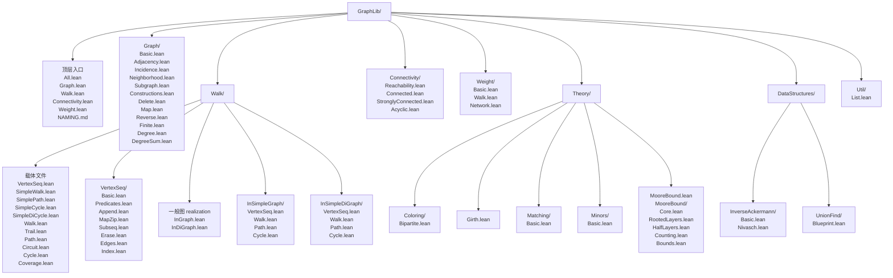

```mermaid
flowchart TB
  root["GraphLib/"]

  root --> entry["顶层入口<br/>All.lean<br/>Graph.lean<br/>Walk.lean<br/>Connectivity.lean<br/>Weight.lean<br/>NAMING.md"]
  root --> graphFolder["Graph/<br/>Basic.lean<br/>Adjacency.lean<br/>Incidence.lean<br/>Neighborhood.lean<br/>Subgraph.lean<br/>Constructions.lean<br/>Delete.lean<br/>Map.lean<br/>Reverse.lean<br/>Finite.lean<br/>Degree.lean<br/>DegreeSum.lean"]
  root --> walk["Walk/"]
  root --> connectivity["Connectivity/<br/>Reachability.lean<br/>Connected.lean<br/>StronglyConnected.lean<br/>Acyclic.lean"]
  root --> weight["Weight/<br/>Basic.lean<br/>Walk.lean<br/>Network.lean"]
  root --> theory["Theory/"]
  root --> data["DataStructures/"]
  root --> util["Util/<br/>List.lean"]

  walk --> walkCore["载体文件<br/>VertexSeq.lean<br/>SimpleWalk.lean<br/>SimplePath.lean<br/>SimpleCycle.lean<br/>SimpleDiCycle.lean<br/>Walk.lean<br/>Trail.lean<br/>Path.lean<br/>Circuit.lean<br/>Cycle.lean<br/>Coverage.lean"]
  walk --> vertexSeq["VertexSeq/<br/>Basic.lean<br/>Predicates.lean<br/>Append.lean<br/>MapZip.lean<br/>Subseq.lean<br/>Erase.lean<br/>Edges.lean<br/>Index.lean"]
  walk --> generalRealization["一般图 realization<br/>InGraph.lean<br/>InDiGraph.lean"]
  walk --> simpleGraphRealization["InSimpleGraph/<br/>VertexSeq.lean<br/>Walk.lean<br/>Path.lean<br/>Cycle.lean"]
  walk --> simpleDiGraphRealization["InSimpleDiGraph/<br/>VertexSeq.lean<br/>Walk.lean<br/>Path.lean<br/>Cycle.lean"]

  theory --> coloring["Coloring/<br/>Bipartite.lean"]
  theory --> girth["Girth.lean"]
  theory --> matching["Matching/<br/>Basic.lean"]
  theory --> minors["Minors/<br/>Basic.lean"]
  theory --> moore["MooreBound.lean<br/>MooreBound/<br/>Core.lean<br/>RootedLayers.lean<br/>HalfLayers.lean<br/>Counting.lean<br/>Bounds.lean"]

  data --> inverseAckermann["InverseAckermann/<br/>Basic.lean<br/>Nivasch.lean"]
  data --> unionFind["UnionFind/<br/>Blueprint.lean"]
```

```mermaid
flowchart TB
  namespaceRoot["root namespace"]
  namespaceRoot --> graphLib["GraphLib"]
  namespaceRoot --> inverseAckermann["InverseAckermann"]
  namespaceRoot --> unionFind["UnionFind"]

  graphLib --> graphNs["Graph"]
  graphLib --> simpleGraph["SimpleGraph"]
  graphLib --> diGraph["DiGraph"]
  graphLib --> simpleDiGraph["SimpleDiGraph"]
  graphLib --> carriers["载体 namespaces"]
  graphLib --> shared["共享 namespaces"]

  graphNs --> graphRelations["IsSubgraph<br/>IsSpanningSubgraph<br/>IsInducedSubgraph"]
  graphNs --> graphWalk["IsWalkIn<br/>IsTrailIn<br/>IsPathIn<br/>IsCircuitIn<br/>IsCycleIn"]
  graphNs --> graphConnectivity["Reachable<br/>Preconnected<br/>Connected<br/>IsForest<br/>IsTree"]
  graphNs --> graphData["VertexWeight<br/>EdgeWeight<br/>Cost"]

  simpleGraph --> simpleGraphRelations["IsSubgraph<br/>IsSpanningSubgraph<br/>IsInducedSubgraph"]
  simpleGraph --> simpleGraphWalk["IsVertexSeqIn<br/>IsSimpleWalkIn<br/>IsSimplePathIn<br/>IsSimpleCycleIn<br/>Eulerian / Hamiltonian predicates"]
  simpleGraph --> simpleGraphConnectivity["Reachable<br/>Preconnected<br/>Connected<br/>IsAcyclic<br/>IsForest<br/>IsTree"]
  simpleGraph --> simpleGraphTheory["girth<br/>MooreBound<br/>IsProperTwoColoring<br/>IsBipartite"]
  simpleGraph --> simpleGraphData["VertexWeight<br/>EdgeWeight<br/>Cost"]

  diGraph --> diGraphRelations["IsSubgraph<br/>IsSpanningSubgraph<br/>IsInducedSubgraph"]
  diGraph --> diGraphWalk["IsWalkIn<br/>IsTrailIn<br/>IsPathIn<br/>IsCircuitIn<br/>IsCycleIn"]
  diGraph --> diGraphConnectivity["Reachable<br/>StronglyConnected<br/>IsStronglyConnected<br/>IsAcyclic"]
  diGraph --> diGraphData["VertexWeight<br/>EdgeWeight<br/>Cost<br/>Capacity<br/>Network<br/>Flow"]

  simpleDiGraph --> simpleDiGraphRelations["IsSubgraph<br/>IsSpanningSubgraph<br/>IsInducedSubgraph"]
  simpleDiGraph --> simpleDiGraphWalk["IsVertexSeqIn<br/>IsSimpleWalkIn<br/>IsSimplePathIn<br/>IsSimpleDiCycleIn<br/>Eulerian / Hamiltonian predicates"]
  simpleDiGraph --> simpleDiGraphConnectivity["Reachable<br/>StronglyConnected<br/>IsStronglyConnected<br/>IsAcyclic"]
  simpleDiGraph --> simpleDiGraphData["VertexWeight<br/>EdgeWeight<br/>Cost<br/>Capacity"]

  carriers --> identity["Edge<br/>Arc"]
  carriers --> vertexWalk["VertexSeq<br/>SimpleWalk<br/>SimplePath<br/>SimpleCycle<br/>SimpleDiCycle"]
  carriers --> taggedWalk["Walk<br/>Path<br/>Trail<br/>DiTrail<br/>Circuit<br/>DiCircuit<br/>Cycle<br/>DiCycle"]

  shared --> matching["Matching"]
  shared --> listSet["List<br/>Set"]

  inverseAckermann --> nivasch["Nivasch"]
  unionFind --> unionFindParts["Correctness<br/>RankInvariant<br/>Potential<br/>AmortisedFind<br/>AmortisedUnion<br/>MainTheorem"]
```
